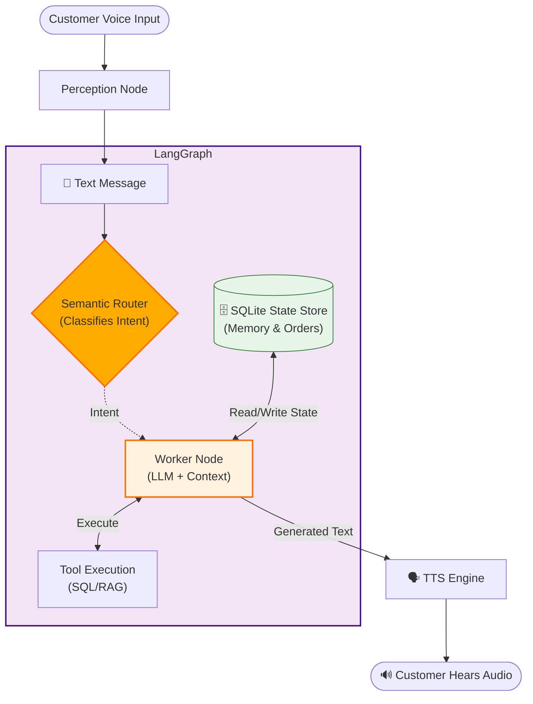

# ADR 0002: Integrated Fast Router & Semantic Layer

```mermaid
flowchart TD
    %% 1. Entry Point
    START([Customer Voice Input]) --> Perception["Perception Node"]
    Perception --> Msg["📨 Text Message"]

    %% 2. The LangGraph Orchestrator
    subgraph LangGraph
        direction TB
        Msg --> Router{"Semantic Router<br/>(Classifies Intent)"}

        %% The Worker Node does everything
        Router -.->|Intent| Worker["Worker Node<br/>(LLM + Context)"]

        %% State interaction
        SQL[("🗄️ SQLite State Store<br/>(Memory & Orders)")] <-->|Read/Write State| Worker

        %% Tool Interaction (Managed by Worker)
        Worker <-->|Execute| Tools["Tool Execution<br/>(SQL/RAG)"]
    end

    %% 3. Exit Pipeline
    Worker -->|Generated Text| TTS["🗣️ TTS Engine"]
    TTS --> END([🔊 Customer Hears Audio])

    %% Styling
    style LangGraph fill:#f3e5f5,stroke:#4a148c,stroke-width:2px
    style SQL fill:#e8f5e9,stroke:#2e7d32
    style Router fill:#ffab00,stroke:#ff6f00,stroke-width:2px
    style Worker fill:#fff3e0,stroke:#ff6f00,stroke-width:2px


```
