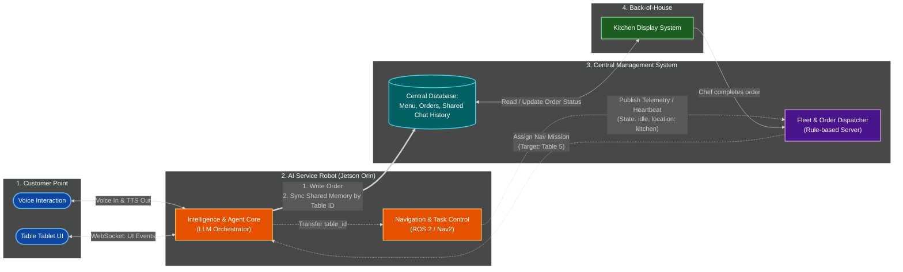
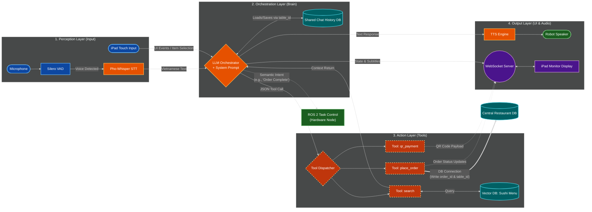
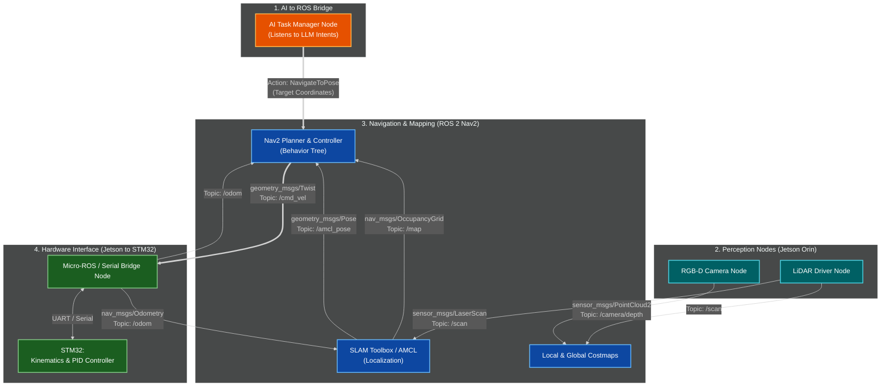

# AI Waiter: System Architecture Documentation

This document outlines the multi-layered architecture of the AI Waiter project, covering the high-level system components, the internal AI Orchestration layers, and the ROS 2 hardware integration.

---

## 1. High-Level System Architecture
This diagram shows the interaction between the Customer, the Robot (Jetson Orin), the Central Management System, and the Kitchen.

---

## 2. AI Brain: Orchestration & Layers
A focus on the 4-layer internal architecture of the AI service, from raw perception to action dispatching.

---

## 3. Robotics: ROS 2 & Hardware Bridge
The integration between the AI Task Manager and the low-level hardware control using the Nav2 stack.

