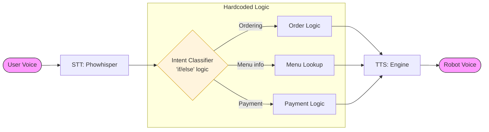
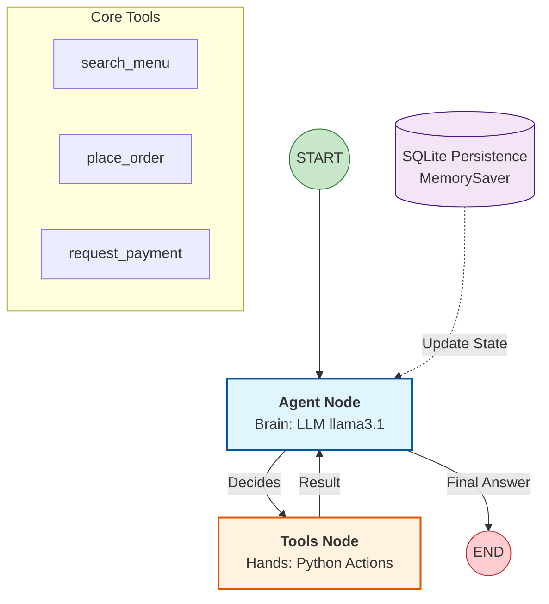

# System Architecture: Old vs. New Pipeline

This document contains Mermaid diagrams for the AI Waiter architecture. You can copy the code below directly into [Mermaid Live Editor](https://mermaid.live/) or any Markdown viewer that supports Mermaid (like VS Code or GitHub) for your slides.

---

## 1. The "Old" Pipeline (Sequential & Rigid)

The old system followed a brittle, linear path. If any stage failed or the user asked something "outside the plan," the whole chain broke.

### Why it was "Stupid":
- **No Memory**: Every interaction was a fresh start.
- **Rigid flow**: Couldn't handle multi-step requests (e.g., "Check the price AND THEN order").
- **Fragile**: Adding a new feature required rewriting the central `if/else` logic.

---

## 2. The "New" Pipeline (LangGraph Agentic)

The new system is **cyclic** and **stateful**. The LLM acts as the "Brain" that decides which "Hands" (Tools) to use based on the current context stored in a persistent checkpoint.

### Why it is "Smart":
- **Cyclic Reasoning**: The agent can call multiple tools in one "turn" (e.g., Search -> Calculate -> Confirm).
- **Persistent State**: SQLite acts as the robot's long-term memory. It remembers you across sessions.
- **Modular Tools**: Adding a new feature is as simple as adding a new tool function; the LLM automatically learns how to use it.

---

## 3. Comparative Summary

| Feature | Old Pipeline | LangGraph Agent |
| :--- | :--- | :--- |
| **Logic** | Hardcoded `if/else` | LLM Reasoning |
| **Flow** | Linear (One-way) | Cyclic (Looping) |
| **Memory** | None (Stateless) | SQLite (Persistent) |
| **Context** | Single-shot response | Multi-turn conversation |
| **Complexity** | Simple but fragile | Sophisticated & robust |
