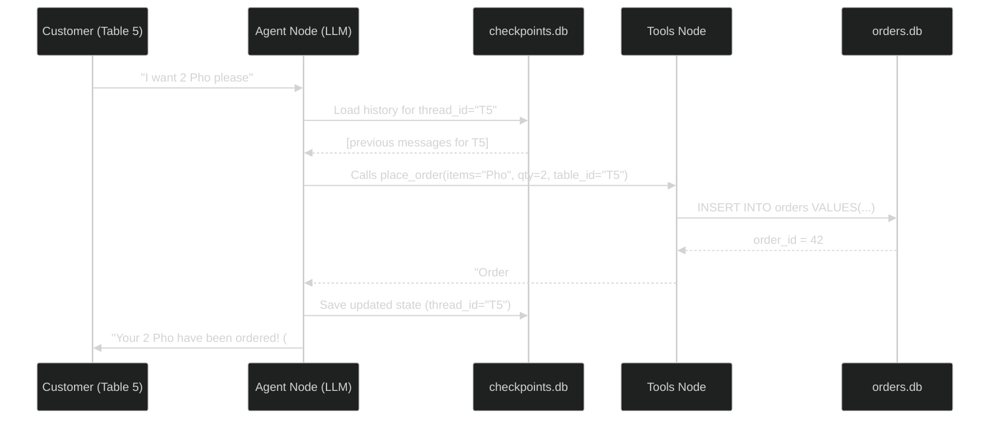

# Tutorial: SQLite — Persistent Memory for the AI Waiter

This document covers two things: (1) **SQLite fundamentals** so you understand the database, and (2) **how to use `SqliteSaver`** to upgrade the AI Waiter's memory from a simple RAM-based store to a fully persistent conversation history that survives server restarts.

---

## Installation

### 1. `sqlite3` — Built-in, No Install Needed

Python's `sqlite3` module ships with the standard library. You already have it.

```bash
# Verify it works (in your deeplearning environment)
mamba activate deeplearning
python -c "import sqlite3; print(sqlite3.sqlite_version)"
# Expected output: 3.x.x
```

### 2. `langgraph-checkpoint-sqlite` — For LangGraph Memory

This is the LangGraph-specific adapter that wraps SQLite into a `SqliteSaver` checkpointer.

```bash
# Activate your environment first
mamba activate deeplearning

# Install the checkpoint adapter
pip install langgraph-checkpoint-sqlite

# Verify the install
python -c "from langgraph.checkpoint.sqlite import SqliteSaver; print('OK')"
```

> [!NOTE]
> `langgraph-checkpoint-sqlite` is a **separate package** from `langgraph`. It is not installed automatically and must be added explicitly. Add it to `requirements.txt` after installing.

**Update `requirements.txt`:**

```text
# requirements.txt
rclpy
python-dotenv
numpy
langchain-core
langchain-community
langchain-huggingface
langchain-ollama
langgraph
langgraph-checkpoint-sqlite    # ← Add this line
faiss-cpu
rank-bm25
sentence-transformers
pydantic>=2.0
```

### 3. (Optional) SQLite CLI — For Manual Inspection

The `sqlite3` command-line tool lets you inspect your databases directly from the terminal. Useful for debugging.

```bash
# Install on Ubuntu/Debian
sudo apt-get install sqlite3

# Open a database file
sqlite3 data/sqlite/orders.db

# Inside the sqlite3 shell:
.tables                        -- List all tables
.schema orders                 -- Show the CREATE TABLE statement
SELECT * FROM orders;          -- Query data
.quit                          -- Exit
```

---

## Part 1: SQLite Fundamentals

### What is SQLite?

SQLite is a **file-based relational database**. Unlike a typical database server (like MySQL or PostgreSQL), SQLite stores everything in a single `.db` file on your disk. There is no server to start, no complex setup — it just works.

> [!NOTE]
> This is why it is already used in your project for `orders.db`. It is the perfect choice for embedded applications, local development, and any system running on a robot.

### Core Concepts

| Concept | What it means | Analogy |
| :--- | :--- | :--- |
| **Database (`.db` file)** | The container for all data | An Excel Workbook |
| **Table** | A grid that stores one type of data | An Excel Sheet |
| **Row** | One record inside a table | One row in the Sheet |
| **Column** | One field of data in a row | One column header |
| **Primary Key** | A unique ID for every row | Row number, never duplicated |

### Basic SQL Commands You Need to Know

```sql
-- 1. Create a table (run once to set up the structure)
CREATE TABLE IF NOT EXISTS orders (
    id          INTEGER PRIMARY KEY AUTOINCREMENT,  -- Auto-incrementing unique ID
    table_id    TEXT    NOT NULL,
    items       TEXT    NOT NULL,
    quantity    INTEGER NOT NULL,
    status      TEXT    DEFAULT 'CONFIRMED',
    created_at  TEXT    NOT NULL
);

-- 2. Insert a new row
INSERT INTO orders (table_id, items, quantity, created_at)
VALUES ('T5', 'Sushi x2, Miso Soup x1', 3, '2026-04-11 20:00:00');

-- 3. Select (query) all rows
SELECT * FROM orders;

-- 4. Select with conditions
SELECT * FROM orders WHERE table_id = 'T5';
SELECT * FROM orders WHERE status = 'CONFIRMED' ORDER BY created_at DESC;

-- 5. Update a specific row
UPDATE orders SET status = 'DELIVERED' WHERE id = 5;

-- 6. Delete a row
DELETE FROM orders WHERE id = 5;
```

### Using SQLite in Python

Python has a **built-in `sqlite3` module** — no `pip install` needed.

```python
import sqlite3

# Step 1: Connect to the database file (creates it if it doesn't exist)
conn = sqlite3.connect("data/sqlite/orders.db")

# Step 2: Get a "cursor" — this is the tool that actually sends SQL commands
cursor = conn.cursor()

# Step 3: Execute SQL
cursor.execute("""
    INSERT INTO orders (table_id, items, quantity, created_at)
    VALUES (?, ?, ?, ?)
""", ('T5', 'Pho', 2, '2026-04-11 20:00:00'))  # ← use '?' to prevent SQL injection

# Step 4: Commit (save) the changes
conn.commit()

# Step 5: Close the connection (important!)
conn.close()
```

> [!IMPORTANT]
> Always use `?` placeholders when inserting user-provided data, never use f-strings or `.format()`.
> This prevents **SQL Injection**, where malicious input can corrupt or expose your database.

### Fetching Data

```python
conn = sqlite3.connect("data/sqlite/orders.db")
cursor = conn.cursor()

# fetchall() returns a list of tuples
cursor.execute("SELECT id, items, status FROM orders WHERE table_id = ?", ('T5',))
rows = cursor.fetchall()

for row in rows:
    print(f"Order #{row[0]}: {row[1]} — Status: {row[2]}")

conn.close()
```

---

## Part 2: LangGraph Memory — `MemorySaver` vs `SqliteSaver`

Here is the critical difference between the two checkpointers we can use:

| Feature | `MemorySaver` | `SqliteSaver` |
| :--- | :--- | :--- |
| **Storage** | RAM (Python dict) | Disk (`.db` file) |
| **Speed** | Fastest | Very fast |
| **Persistent?** | ❌ No — lost on restart | ✅ Yes — survives restarts |
| **Multi-process safe?** | ❌ No | ✅ Yes |
| **Use case** | Testing / Development | Production |

### The Problem with `MemorySaver`

Our current `memory.py` uses `MemorySaver`:
```python
# Current memory.py — data is lost every time the node restarts
from langgraph.checkpoint.memory import MemorySaver

def get_checkpointer():
    return MemorySaver()
```

If the ROS 2 AI Waiter node crashes and restarts, **every customer's conversation history is wiped**. Table 5's order context is gone. This is unacceptable in production.

### Upgrading to `SqliteSaver`

`SqliteSaver` is provided by `langgraph-checkpoint-sqlite`. It works identically to `MemorySaver` from LangGraph's perspective — we just swap it out in `memory.py`.

**Step 1: Install the package**
```bash
# Run in the 'deeplearning' conda environment
pip install langgraph-checkpoint-sqlite
```

**Step 2: Update `memory.py`**

```python
# orchestrator/memory.py — UPGRADED VERSION
from langgraph.checkpoint.sqlite import SqliteSaver
from ai_waiter_core.core.config import settings

# The path where the conversation history database will be saved
CHECKPOINT_DB_PATH = str(settings.DATA_DIR / "sqlite" / "checkpoints.db")

def get_checkpointer():
    """
    Returns a SqliteSaver that persists conversation history to disk.
    The database is stored separately from orders.db for clean separation.
    """
    return SqliteSaver.from_conn_string(CHECKPOINT_DB_PATH)

def create_config(table_id: str):
    """
    Creates a LangGraph config dict using table_id as the thread_id.
    This tells the agent which conversation history to load.
    """
    return {"configurable": {"thread_id": table_id}}
```

**Step 3: How it is used in `agent.py`** (no changes needed here!)

```python
# orchestrator/agent.py — unchanged, SqliteSaver is a drop-in replacement
from .memory import get_checkpointer

app = workflow.compile(checkpointer=get_checkpointer())
```

### What Does `SqliteSaver` Actually Store?

When you call `app.invoke(...)` with a `thread_id`, LangGraph automatically creates tables like this in `checkpoints.db`:

```
checkpoints table:
  thread_id | checkpoint_id | parent_id | checkpoint_data (serialized JSON)

writes table:
  thread_id | checkpoint_id | task_id   | channel | value
```

You never write SQL for these tables yourself — **LangGraph manages them automatically**. You only need to provide the database path.

### Inspecting Conversation History

You can query the checkpoints database directly to debug conversations:

```python
import sqlite3

conn = sqlite3.connect("data/sqlite/checkpoints.db")
cursor = conn.cursor()

# List all active conversation threads
cursor.execute("SELECT DISTINCT thread_id FROM checkpoints")
threads = cursor.fetchall()
print("Active sessions:", threads)

# Get all checkpoints for a specific table
cursor.execute("SELECT checkpoint_id, parent_id FROM checkpoints WHERE thread_id = ?", ("T5",))
print(cursor.fetchall())

conn.close()
```

---

## Part 3: Separation of Concerns — Two Databases

Our project will use **two separate SQLite databases** for clean architecture:

```
data/
└── sqlite/
    ├── orders.db        ← Business data (what was ordered, status)
    └── checkpoints.db   ← AI memory (conversation history for each table)
```

> [!TIP]
> Keeping them separate allows you to wipe AI conversation history without touching real order data — and vice versa. This is a critical design principle.

### How They Relate — Full Flow



---

## Quick Reference Cheatsheet

```python
# ─────────────────────────── BASIC SQLITE ────────────────────────────
import sqlite3

conn   = sqlite3.connect("path/to/db.db")  # Connect (creates if not exists)
cursor = conn.cursor()

cursor.execute("SQL STATEMENT", (param1, param2))  # Always use ? params
conn.commit()   # Save changes (INSERT, UPDATE, DELETE)
conn.close()    # Always close when done

rows = cursor.fetchall()      # Returns list of tuples: [(col1, col2), ...]
row  = cursor.fetchone()      # Returns a single tuple or None

# ────────────────────────── LANGGRAPH MEMORY ─────────────────────────
from langgraph.checkpoint.sqlite import SqliteSaver

# Create the checkpointer (pass to workflow.compile)
checkpointer = SqliteSaver.from_conn_string("data/sqlite/checkpoints.db")

# Compile graph with persistent memory
app = workflow.compile(checkpointer=checkpointer)

# Invoke with a specific table's thread (memory is auto-loaded and saved)
config = {"configurable": {"thread_id": "T5"}}
result = app.invoke({"messages": [HumanMessage("Hello!")], "table_id": "T5"}, config=config)

# Stream responses token-by-token (used in ROS 2 node)
for chunk in app.stream(input_data, config=config, stream_mode="values"):
    print(chunk["messages"][-1].content)
```

---

> [!NOTE]
> **Next Step**: Once `SqliteSaver` is in place, we can look at **conversation summarization** — automatically trimming old messages to keep the context window small, while still preserving key facts like the customer's name or past orders.
