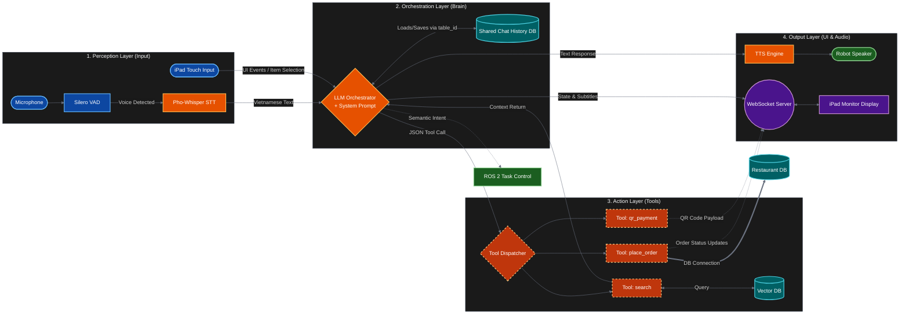

# AI Waiter — Pipeline Evolution: From Monolithic Chain to Agentic Graph

> **Presenter:** Le Quoc Thinh — 22134013
> **Topic:** Evolution of an AI Waiter System

---

## 1. The "True" Old Architecture (Project Legacy)

This is the system as originally built—a robust but complex 4-layer monolithic pipeline.

### 1.1 Old Architecture Diagram

---

## 2. Advanced Analysis: Why This "Advanced" System Failed

Even though this system looks professional, it suffered from **"Monolithic Thinking."**

### 2.1 The "Manual Context Hot-Potato" 🥔
In your old system, you had to manually `"Load/Save via table_id"` from a `Shared Chat History DB`.
- **The Stupidity**: The Orchestrator had to wait for a database query to even *remember* who it was talking to before processing.
- **LangGraph Fix**: `Checkpointers` are built-in. History is not a separate DB call you manage; it's the **State** of the graph itself, automatically managed by `thread_id`.

### 2.2 The "Rigid Dispatcher" ⚙️
You had a separate `Tool Dispatcher` node that interpreted JSON calls.
- **The Stupidity**: If the LLM made a small typo in the JSON, the Dispatcher would crash the whole action layer. The LLM couldn't "see" the crash to fix it.
- **LangGraph Fix**: The **Tools Node** is part of the graph loop. If a tool fails, the error goes **back into the Agent's message history**. The Agent reads the error and retries or corrects its JSON automatically.

### 2.3 Subgraph Synchronization Nightmares 😵‍💫
Look at `Layer 4`. You had `T_Order` and `T_QR` sending updates directly to a `WebSocket Server` while the `Orchestrator` sent subtitles.
- **The Stupidity**: **De-synchronization**. The iPad might show "Order Complete" (via tool) before the Robot speaks "Your order is ready" (via orchestrator). The UI and Audio could easily get out of sync.
- **LangGraph Fix**: The **State is the Single Source of Truth**. Everything (Audio, UI state, Order status) is written to the `AgentState` first, and then emitted as a single, synchronized update.

### 2.4 Semantic vs. Task Conflict 🧠
You had one `LLM Orchestrator` trying to handle:
1. Low-level Hardware Tasks (ROS 2 Nav)
2. High-level Social Chat (TTS)
3. UI State (WS Server)
- **The Stupidity**: **Instruction Dilution**. Testing one part (e.g., social chat) might accidentally break how the robot navigates because they share the same massive System Prompt.
- **LangGraph Fix**: **Modular Nodes**. You can have a `navigation_node` and a `chat_node` with separate, focused instructions, while still sharing the same state.

---

## 3. Comparison of the "Brain" Logic

| Dimension | Old Orchestrator (Monolith) | LangGraph (Agentic) |
| :--- | :--- | :--- |
| **History** | Manual fetch from DB via `table_id` | Automatic state recovery via `thread_id` |
| **Tool Errors** | Dispatcher crashes or returns code | Error goes to Agent's brain for "Self-Healing" |
| **Side Effects** | Multi-path (WS, ROS 2, TTS concurrently) | Unified state updates (Linear logic) |
| **Scaling** | Complex global state management | Isolated, parallel graph instances |
| **Hardware** | Hardcoded ROS 2 calls | Decoupled Navigation Tools |

---

### Key Presentation Takeaway:
> "My old system was a **Multi-Layer Monolith**. It looked organized on paper, but in production, the *side effects* and *manual session management* made it fragile. LangGraph allowed me to stop being a **State Manager** and start being a **Workflow Designer**."
