# AI Waiter Project: Slide Presentation Content

---

## 1. Overview System (Modular Architecture)

A high-level "Block-to-Block" look at how the entire robot platform operates.

```mermaid
%%{init: {'theme': 'dark', 'themeVariables': {'background': '#191919', 'mainBkg': '#1e1e1e', 'lineColor': '#6b7280', 'edgeLabelBackground': '#191919', 'clusterBkg': '#1a1a1a', 'clusterBorder': '#374151', 'titleColor': '#f9fafb', 'nodeTextColor': '#f9fafb', 'primaryTextColor': '#f9fafb'}}}%%
flowchart LR
    subgraph PERCEPTION ["1. Perception"]
        direction TB
        MIC([🎤 Mic]) --> VAD[VAD Filter]
        VAD --> STT[Speech to Text]
        PAD["iPad Touch Input"]
    end

    subgraph BRAIN ["2. AI Brain (Orchestrator)"]
        direction TB
        GRAPH["<b>LangGraph</b><br/>Stateful Reasoning"]
        MEM[("Memory<br/>SQLite")]
        GRAPH <--> MEM
    end

    subgraph ACTION ["3. Action & Tools"]
        direction TB
        RAG["Hybrid Search<br/>(BM25 + Vector)"]
        ORD["Order System<br/>(Draft/Verify)"]
        PAY["QR Payment"]
    end

    subgraph INTERFACE ["4. Output & Interface"]
        direction TB
        TTS[Text to Speech]
        WS[WebSocket UI]
        ROS2[ROS 2 Control]
    end

    PERCEPTION --> BRAIN
    BRAIN <--> ACTION
    BRAIN --> INTERFACE

    style PERCEPTION fill:#1e2a4a,stroke:#3b82f6
    style BRAIN fill:#3b1e00,stroke:#d97706
    style ACTION fill:#1e3a2f,stroke:#059669
    style INTERFACE fill:#2a1f3a,stroke:#8b5cf6
```

---

## 2. The Misunderstandings (Mental Model Errors)

The biggest hurdles weren't the code, but the **wrong mental model** of how LLMs work:

1.  **Response = Point, not Sequence**:
    *   *Misconception*: Thinking an LLM is a stateful program that runs A → B → C.
    *   *Reality*: Every LLM call is an isolated "snapshot" (a point in space) based on its current context. If you want a sequence, you must build a **state machine** (Graph) around it.
2.  **Instruction Overload**:
    *   *Misconception*: Giving the LLM a 500-line prompt to do 10 different tasks.
    *   *Reality*: "Instruction Dilution." The more you ask it to do in one prompt, the higher the chance it ignores critical rules (like allergies).
3.  **Manual State Control**:
    *   *Misconception*: Trying to manually "stitch" history strings together.
    *   *Reality*: Context becomes messy and fragmented. You need a structured **State Object**.

---

## 3. Old AI Brain Pipeline (Branched Architecture)

Referencing the original design (`docs/pipeline.jpg`):

```mermaid
%%{init: {'theme': 'dark', 'themeVariables': {'background': '#191919', 'mainBkg': '#1e1e1e', 'lineColor': '#6b7280', 'edgeLabelBackground': '#191919', 'clusterBkg': '#1a1a1a', 'clusterBorder': '#374151', 'titleColor': '#f9fafb', 'nodeTextColor': '#f9fafb', 'primaryTextColor': '#f9fafb'}}}%%
flowchart LR
    Input([Input]) --> Router{Llama Router}
    
    Router -- "Branch 1: Action" --> ToolUse["Tool Selection"]
    ToolUse --> Result[Tool Result Data]
    Result --> Synthesis[Response Synthesis]
    
    Router -- "Branch 2: Chat" --> Direct[Direct Output]
    
    Direct --> Synthesis
    Synthesis --> Output([Output])

    style Router fill:#3b0f0f,stroke:#ef4444
    style ToolUse fill:#1f2937,stroke:#6366f1
```

---

## 4. The Problem — Limitations

Why the old system couldn't survive a real restaurant environment:

1.  **Latency (Double Tax)**:
    *   Running the LLM twice (once to route, once to act) created a **4-6 second delay** on consumer hardware.
2.  **Tool Handling Isolation**:
    *   The router had no idea what the tool actually did. If a search failed, the router couldn't "see" the error to try a different query.
3.  **Multi-Table Threading Disaster**:
    *   History was managed in a single global RAM list. If Table 1 and Table 2 spoke at the same time, their conversations got "merged," leading to the robot serving the wrong people.
4.  **Static History Problem**:
    *   Manually loading/saving JSON history files was slow and prone to corruption during high-traffic ordering.

---

## 5. The New AI Brain: LangGraph

The current architecture: Cyclic, Stateful, and Self-Healing.

```mermaid
%%{init: {'theme': 'dark', 'themeVariables': {'background': '#191919', 'mainBkg': '#1e1e1e', 'lineColor': '#6b7280', 'edgeLabelBackground': '#191919', 'clusterBkg': '#1a1a1a', 'clusterBorder': '#374151', 'titleColor': '#f9fafb', 'nodeTextColor': '#f9fafb', 'primaryTextColor': '#f9fafb'}}}%%
flowchart TD
    START((START)) --> AGENT["🧠 Agent Node<br/>(Single-Thought Reasoning)"]
    
    AGENT -- "Tool Request" --> TOOLS{Tools Node}
    
    subgraph TOOLSET [Available Skills]
        direction LR
        S[search_menu]
        O[place_order]
        P[request_payment]
    end
    
    TOOLS --> TOOLSET
    TOOLSET -->|"Result Back to Brain"| AGENT
    
    AGENT -- "Final Response" --> END((END))
    
    %% Memory Side-car
    MEM[("SQLite Persistence<br/>thread_id isolation")] -.-> AGENT

    style AGENT fill:#1e2a4a,stroke:#3b82f6
    style TOOLSET fill:#1e3a2f,stroke:#059669
    style MEM fill:#2a1f3a,stroke:#8b5cf6
```

**Why it's better:**
- **Single Inference**: Intent and Action happen in one step.
- **Auto-Recovery**: If a tool fails, the error goes back to the Agent to fix its own mistake.
- **Isolated Threads**: SQLite keeps every table's brain in a separate, secure box.

---

## 6. Tasks Completed (Implementation Progress)

Summary of work finalized in the `ai_waiter_core` codebase:

### ✅ Perception Layer
- [x] **Silero VAD** integration for noise filtering.
- [x] **PhoWhisper ASR** configuration for high-accuracy Vietnamese speech.

### ✅ Orchestration & Memory
- [x] **LangGraph logic** implementation (Agent + Tool loop).
- [x] **SQLite Memory Store** for persistent conversation history.
- [x] **Thread ID System** for multi-table concurrency support.

### ✅ Real-world Tooling
- [x] **Hybrid Search Engine**: Combined Vector (FAISS) and Keyword (BM25) search.
- [x] **Order Database Logic**: "Draft-Verify-Commit" protocol for safe ordering.
- [x] **QR Payment Generator**: Dynamic link generation for table bills.

### ✅ Interface & Simulation
- [x] **WebSocket Server**: Real-time sync between Robot and iPad interface.
- [x] **Gazebo Simulation**: Modular restaurant environment with track and table markers.
- [x] **ROS 2 Integration**: Connection between AI High-level brain and Robot low-level tasks.
