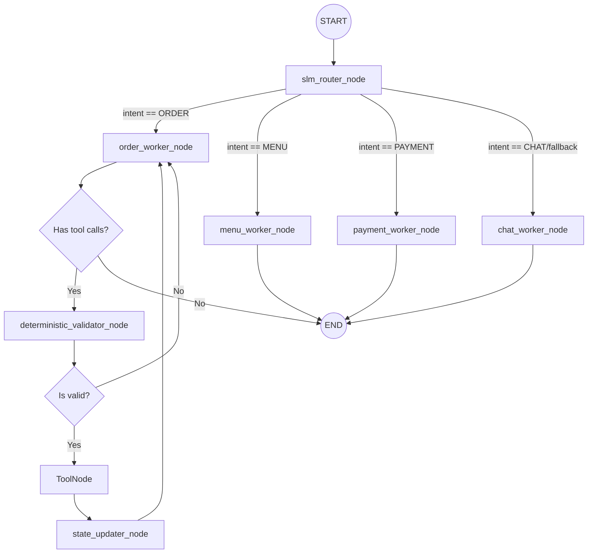

# AI Waiter Agent Graph

This diagram illustrates the state machine workflow defined in `robot_ws/src/ai_waiter_core/ai_waiter_core/agent/graph.py`.

```mermaid
graph TD
    START((START)) --> router[slm_router_node]

    router -- intent == ORDER --> order_worker[order_worker_node]
    router -- intent == MENU --> menu_worker[menu_worker_node]
    router -- intent == PAYMENT --> payment_worker[payment_worker_node]
    router -- intent == CHAT/fallback --> chat_worker[chat_worker_node]

    order_worker --> route_after_order{Has tool calls?}
    route_after_order -- Yes --> validator[deterministic_validator_node]
    route_after_order -- No --> END((END))

    validator --> route_after_validator{Is valid?}
    route_after_validator -- Yes --> tools[ToolNode]
    route_after_validator -- No --> order_worker

    tools --> state_updater[state_updater_node]
    state_updater --> order_worker

    menu_worker --> END
    payment_worker --> END
    chat_worker --> END
```
