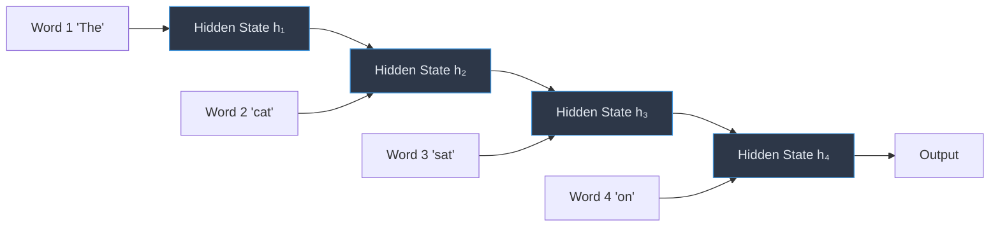
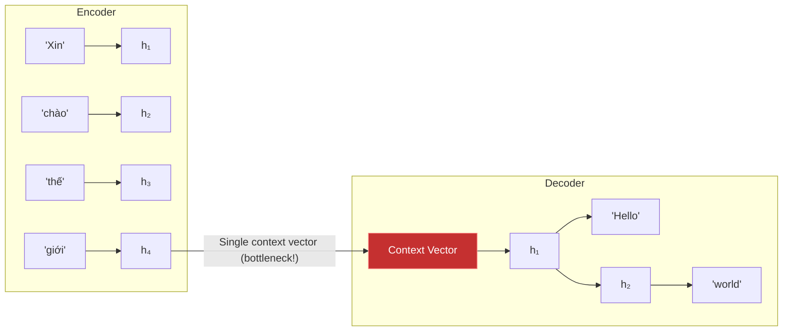
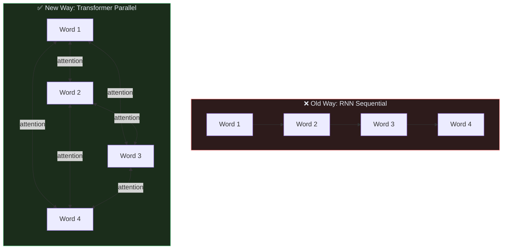
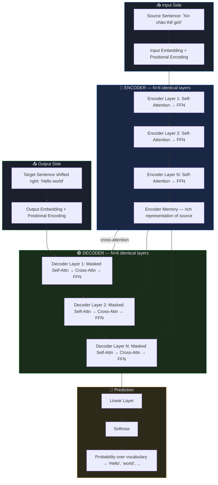
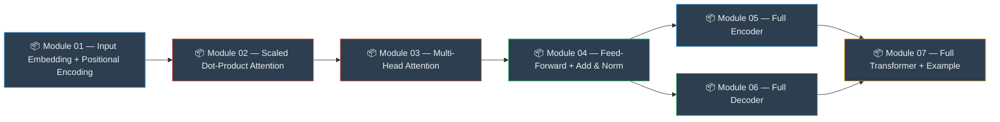
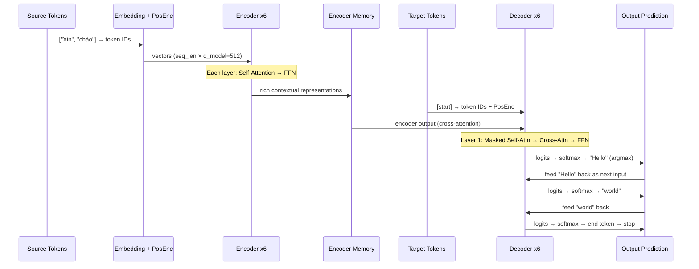

# Transformer — Module 00: Overview & Motivation

> **Paper:** "Attention Is All You Need" — Vaswani et al., 2017
> **Link:** https://arxiv.org/abs/1706.03762
>
> This document covers the **"Why"** — the problems the Transformer was built to solve,
> the big picture architecture, and how data flows from input to output.

---

## 1. The Problem: What Was Wrong Before?

Before the Transformer (2017), the best models for language tasks were **RNNs** (Recurrent Neural Networks) and their improved variant **LSTMs** (Long Short-Term Memory).

### How RNNs Work (and Why They Fail)

An RNN processes a sentence **one word at a time, left to right**. Each word updates a **hidden state** that carries memory forward.

**Critical Problems with this approach:**

| Problem | Explanation |
| :--- | :--- |
| **Sequential bottleneck** | Word 4 cannot be processed until Word 3 is done. Cannot parallelize on GPU. Slow training. |
| **Vanishing gradients** | In long sentences (100+ words), gradients shrink to nearly zero as they backpropagate. The model "forgets" early words. |
| **Long-range dependency** | "The cat that sat on the mat **is** happy" — the verb "is" refers to "cat", but they are far apart. RNNs lose this connection. |
| **Fixed-size bottleneck** | The entire sentence is compressed into a single hidden state vector. This is lossy — information is destroyed. |

### The Seq2Seq Bottleneck (Translation Example)

For machine translation, RNNs used an **Encoder-Decoder** design with a single "context vector":

**The bottleneck problem:** The entire input sentence is compressed into ONE vector. For long sentences, this single vector cannot remember everything. Quality collapses.

> This was solved by **Attention Mechanism** (Bahdanau et al., 2015), which let the decoder look back at **all** encoder hidden states. The Transformer takes this idea and makes attention **the only mechanism** — removing the RNN entirely.

---

## 2. The Core Idea: "Attention Is All You Need"

The Transformer's core insight:

> **"You don't need recurrence or convolution. Just attention, applied repeatedly."**

Instead of processing left-to-right and passing a hidden state, the Transformer lets **every word look at every other word directly** — all at once, in parallel.

**Key benefits:**
- ✅ **Fully parallelizable** — all words processed simultaneously → 10–100x faster training on GPU
- ✅ **Constant path length** — Word 1 and Word 100 are always directly connected (O(1) vs O(N) in RNN)
- ✅ **No information bottleneck** — every decoder step can look at every encoder position directly

---

## 3. The Big Picture: Transformer Architecture

The Transformer has two halves — an **Encoder** and a **Decoder**, each made of stacked layers.

---

## 4. The Building Blocks (Module Map)

Every Encoder and Decoder layer is built from the same set of sub-modules:

---

## 5. How Data Flows — End to End

Let's trace the sentence **"Xin chào"** → **"Hello"** through the full model:

---

## 6. Key Hyperparameters from the Paper

The paper defines a "base" and "big" model. Here are the base model settings you will see throughout the code:

| Hyperparameter | Symbol | Base Model Value | What It Means |
| :--- | :--- | :--- | :--- |
| Model dimension | `d_model` | **512** | Size of every vector throughout the model |
| Number of heads | `h` | **8** | How many parallel attention perspectives |
| Head dimension | `d_k = d_v` | **64** | `d_model / h = 512 / 8` |
| FFN inner dim | `d_ff` | **2048** | Size of the hidden layer in feed-forward |
| Encoder layers | `N` | **6** | How many encoder layers stacked |
| Decoder layers | `N` | **6** | How many decoder layers stacked |
| Dropout | `p_drop` | **0.1** | Regularization rate |

> [!NOTE]
> These numbers are used consistently in all subsequent module documents. When you see `d_model=512` in code, this is where it comes from.

---

## 7. Why the Transformer Dominated Everything

The paper's results (2017) were dramatic:

- Achieved **28.4 BLEU** on English→German translation — better than all previous models
- Trained in **3.5 days on 8 GPUs** — much cheaper than LSTM alternatives
- **Generalized to other tasks** (parsing, summarization) with no architectural changes

More importantly, the architecture became the foundation for everything that followed:

| Model | Year | Based On |
| :--- | :--- | :--- |
| BERT | 2018 | Transformer **Encoder** only |
| GPT-1/2/3/4 | 2018–2023 | Transformer **Decoder** only |
| T5, BART | 2019–2020 | Full Encoder-Decoder Transformer |
| LLaMA, Mistral | 2023+ | Decoder-only with improvements |

---

## 8. What's Next

You now have the full picture. Each subsequent document dives into **one building block** at a time — concept first, then code:

| Next Document | Topic |
| :--- | :--- |
| `01_input_embedding.md` | Token Embedding + Positional Encoding |
| `02_attention.md` | Scaled Dot-Product Attention |
| `03_multihead.md` | Multi-Head Attention |
| `04_ffn_norm.md` | Feed-Forward + Residual + LayerNorm |
| `05_encoder.md` | Full Encoder Block |
| `06_decoder.md` | Full Decoder Block |
| `07_full.md` | Complete Transformer + Working Example |
