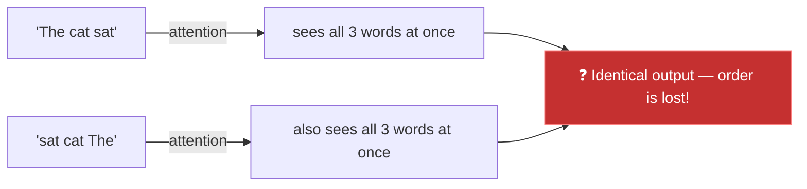
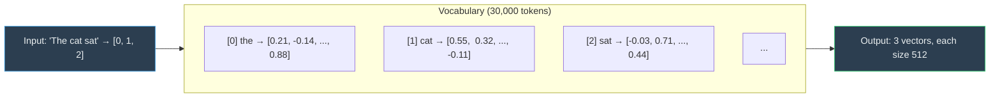
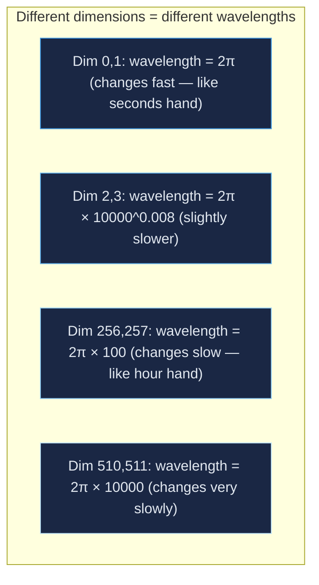
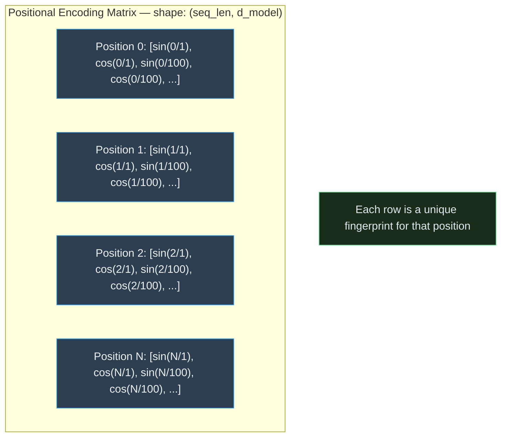
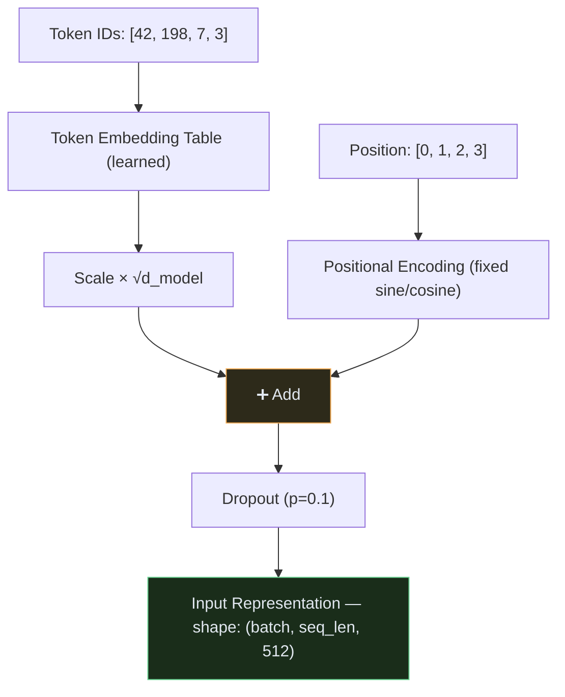

# Transformer — Module 01: Input Embedding + Positional Encoding

> **Paper Section:** 3.4 — Embeddings and Softmax, 3.5 — Positional Encoding
> **Previous:** [Module 00 — Overview](00_overview.md)
> **Next:** [Module 02 — Scaled Dot-Product Attention](02_attention.md)

---

## 1. The Problem This Module Solves

The Transformer takes in **text** — but neural networks only understand **numbers**.

Before any attention or feed-forward layer can run, we need to convert each token (word/subword) into a fixed-size vector of numbers.

But there's a second, deeper problem: **attention has no sense of order**.



Since attention treats the input as a **set** (not a sequence), the model would produce the exact same output for "The cat sat" and "sat cat The". Word order is completely lost.

**This module solves both problems:**
1. `Token Embedding` → converts token IDs to dense vectors
2. `Positional Encoding` → injects order information into those vectors

---

## 2. Step 1 — Token Embedding

### What is it?

A **lookup table**: each token in the vocabulary maps to a learnable vector of size `d_model=512`.



**Key properties:**
- The table has shape `(vocab_size, d_model)` — e.g., `(30000, 512)`
- Each row is the embedding for one token — initialized randomly, **learned during training**
- Similar words end up with similar vectors after training ("cat" ≈ "dog" in vector space)

**From the paper:**
> *"We use learned embeddings to convert the input tokens and output tokens to vectors of dimension d_model."*

The paper also multiplies embeddings by `√d_model` to scale them up before adding positional encoding — this prevents the positional signal from overwhelming the learned embedding signal.

---

### Code: Token Embedding

```python
import torch
import torch.nn as nn
import math

class TokenEmbedding(nn.Module):
    def __init__(self, vocab_size: int, d_model: int):
        """
        Args:
            vocab_size: Total number of unique tokens (e.g., 30,000)
            d_model: Embedding dimension (512 in the base model)
        """
        super().__init__()
        self.embedding = nn.Embedding(vocab_size, d_model)
        self.d_model = d_model

    def forward(self, x: torch.Tensor) -> torch.Tensor:
        """
        Args:
            x: Token IDs — shape (batch_size, seq_len)
        Returns:
            Embeddings — shape (batch_size, seq_len, d_model)
        """
        # Scale by √d_model as specified in the paper (Section 3.4)
        return self.embedding(x) * math.sqrt(self.d_model)


# ── Demo ──
vocab_size = 30000
d_model = 512

token_emb = TokenEmbedding(vocab_size, d_model)

# Simulate a batch of 2 sentences, each 5 tokens long
token_ids = torch.randint(0, vocab_size, (2, 5))  # shape: (2, 5)
embeddings = token_emb(token_ids)

print(f"Input shape:  {token_ids.shape}")    # (2, 5)
print(f"Output shape: {embeddings.shape}")   # (2, 5, 512)
```

---

## 3. Step 2 — Positional Encoding

### Why Can't We Just Learn Position Embeddings?

You might think: "Just add another lookup table for positions 0, 1, 2, …"

That works (BERT does this), but the Transformer paper uses a **fixed, non-learned formula** instead. The key reason:

> **Fixed positional encoding generalizes to longer sequences than seen during training.**
> A learned table for positions 0–512 cannot handle position 513 at test time.
> The sine/cosine formula can extrapolate to any length.

### The Formula

For each position `pos` and each dimension `i` of the encoding:

```
PE(pos, 2i)   = sin( pos / 10000^(2i / d_model) )   ← even dimensions
PE(pos, 2i+1) = cos( pos / 10000^(2i / d_model) )   ← odd dimensions
```

**Breaking this down:**

- `pos` = position in the sequence (0, 1, 2, ...)
- `i` = which dimension we're filling (0 to d_model/2)
- `10000^(2i/d_model)` = a **wavelength** that gets exponentially larger as `i` increases

**Intuition — think of a clock:**



Just like a clock (second → minute → hour hands) creates a **unique combination** for every moment in time, the sine/cosine across all 512 dimensions creates a **unique vector** for every position.

### Why Sine AND Cosine?

The paper says the model can learn to attend to **relative positions** because:

```
PE(pos + k) can be expressed as a linear function of PE(pos)
```

In plain English: the difference between position 5 and position 8 is the same mathematical transformation as between position 20 and position 23. The model can learn "3 steps ahead" as a general concept.

### Visualizing Positional Encoding



---

### Code: Positional Encoding

```python
class PositionalEncoding(nn.Module):
    def __init__(self, d_model: int, max_seq_len: int = 5000, dropout: float = 0.1):
        """
        Args:
            d_model:     Embedding dimension (512)
            max_seq_len: Maximum sequence length to pre-compute (5000 is generous)
            dropout:     Dropout applied after adding PE (paper uses 0.1)
        """
        super().__init__()
        self.dropout = nn.Dropout(p=dropout)

        # ── Build the PE matrix once (not learned — fixed math) ──
        # Shape: (max_seq_len, d_model)
        pe = torch.zeros(max_seq_len, d_model)

        # Position indices: column vector [0, 1, 2, ..., max_seq_len-1]
        position = torch.arange(0, max_seq_len).unsqueeze(1).float()
        # Shape: (max_seq_len, 1)

        # Wavelength divisors: 10000^(2i/d_model) for i=0,1,...,d_model/2
        # Computed in log-space for numerical stability
        div_term = torch.exp(
            torch.arange(0, d_model, 2).float() * (-math.log(10000.0) / d_model)
        )
        # Shape: (d_model/2,)

        # Apply sine to even dimensions (0, 2, 4, ...)
        pe[:, 0::2] = torch.sin(position * div_term)

        # Apply cosine to odd dimensions (1, 3, 5, ...)
        pe[:, 1::2] = torch.cos(position * div_term)

        # Add batch dimension: (1, max_seq_len, d_model)
        # So it broadcasts correctly over (batch_size, seq_len, d_model)
        pe = pe.unsqueeze(0)

        # Register as buffer: saved with the model but NOT a trainable parameter
        self.register_buffer('pe', pe)

    def forward(self, x: torch.Tensor) -> torch.Tensor:
        """
        Args:
            x: Token embeddings — shape (batch_size, seq_len, d_model)
        Returns:
            Embeddings + positional encoding — same shape
        """
        # Add positional encoding up to the actual sequence length
        x = x + self.pe[:, :x.size(1), :]
        return self.dropout(x)


# ── Demo ──
pe_layer = PositionalEncoding(d_model=512, max_seq_len=5000, dropout=0.1)

# Embeddings from previous step: (batch=2, seq_len=5, d_model=512)
output = pe_layer(embeddings)

print(f"Input:  {embeddings.shape}")   # (2, 5, 512)
print(f"Output: {output.shape}")       # (2, 5, 512) — same shape, position info added
```

---

## 4. Combining Both: The Input Representation

The final input to the Encoder (or Decoder) is the **sum** of Token Embedding + Positional Encoding:



**Why addition (not concatenation)?**
If we concatenated, we would double the size from 512 → 1024, making the model twice as expensive.
Addition preserves the size while mixing both signals. The model learns to disentangle them.

---

## 5. Full Module Code

```python
class InputRepresentation(nn.Module):
    """
    Complete input processing: Token Embedding + Positional Encoding.
    This is the very first step in any Transformer model.
    """
    def __init__(self, vocab_size: int, d_model: int, max_seq_len: int = 5000, dropout: float = 0.1):
        super().__init__()
        self.token_embedding = TokenEmbedding(vocab_size, d_model)
        self.positional_encoding = PositionalEncoding(d_model, max_seq_len, dropout)

    def forward(self, token_ids: torch.Tensor) -> torch.Tensor:
        """
        Args:
            token_ids: Shape (batch_size, seq_len) — integer token IDs
        Returns:
            Shape (batch_size, seq_len, d_model) — ready for attention layers
        """
        token_emb = self.token_embedding(token_ids)       # Look up + scale
        return self.positional_encoding(token_emb)        # Add position + dropout


# ── Full Usage Example ──
if __name__ == "__main__":
    VOCAB_SIZE = 30000
    D_MODEL = 512       # Paper: base model
    MAX_LEN = 5000
    DROPOUT = 0.1

    input_repr = InputRepresentation(VOCAB_SIZE, D_MODEL, MAX_LEN, DROPOUT)

    # Simulate: batch of 3 sentences, max 10 tokens each
    batch_size, seq_len = 3, 10
    token_ids = torch.randint(0, VOCAB_SIZE, (batch_size, seq_len))

    output = input_repr(token_ids)
    print(f"Token IDs shape:  {token_ids.shape}")   # (3, 10)
    print(f"Output shape:     {output.shape}")      # (3, 10, 512)

    # Verify each row has a unique positional fingerprint
    pe = input_repr.positional_encoding.pe[0]       # (max_len, d_model)
    similarity_0_1 = torch.cosine_similarity(pe[0].unsqueeze(0), pe[1].unsqueeze(0))
    similarity_0_0 = torch.cosine_similarity(pe[0].unsqueeze(0), pe[0].unsqueeze(0))
    print(f"PE similarity pos0 ↔ pos0: {similarity_0_0.item():.4f}")  # 1.0 (identical)
    print(f"PE similarity pos0 ↔ pos1: {similarity_0_1.item():.4f}")  # < 1.0 (different)
```

---

## 6. Key Takeaways

| Concept | Key Point |
| :--- | :--- |
| **Token Embedding** | Lookup table — token ID → 512-dim learned vector |
| **Scale by √d_model** | Prevents PE from overwhelming token signal |
| **Positional Encoding** | Fixed sine/cosine — not learned, generalizes to any length |
| **Why sine/cosine?** | Enables relative position reasoning (linear transformation property) |
| **Addition not concat** | Preserves d_model=512 size throughout the model |
| **Dropout after PE** | Regularization — prevents over-reliance on any position |

> [!NOTE]
> After this module, the tensor shape is `(batch_size, seq_len, 512)` and stays **exactly this shape** throughout the entire Encoder and Decoder stack. The attention and FFN layers are all designed to maintain this shape.

---

## 7. What's Next

The output of this module — shape `(batch, seq_len, 512)` — is the input to the **Scaled Dot-Product Attention** layer.

| Next | Topic |
| :--- | :--- |
| `02_attention.md` | Scaled Dot-Product Attention — the Q, K, V mechanism |
