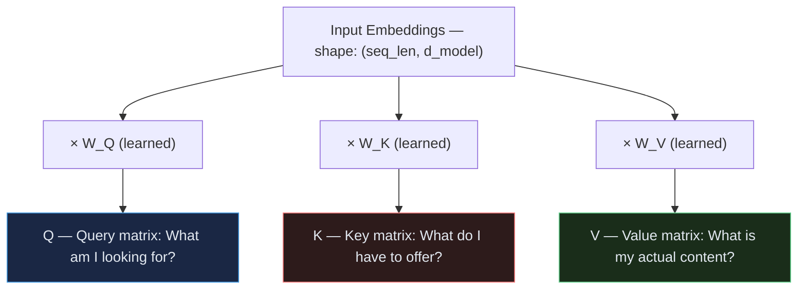
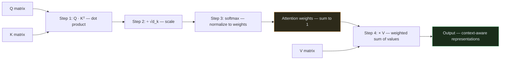
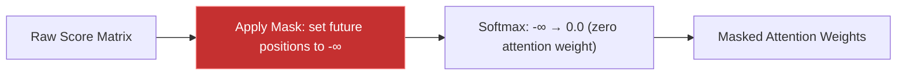

# Transformer — Module 02: Scaled Dot-Product Attention

> **Paper Section:** 3.2.1 — Scaled Dot-Product Attention
> **Previous:** [Module 01 — Input Embedding](01_input_embedding.md)
> **Next:** [Module 03 — Multi-Head Attention](03_multihead.md)

---

## 1. The Problem This Module Solves

After Module 01, every token is now a vector of size 512. But each vector only knows about **itself** — it has no information about the other tokens around it.

> "The bank by the **river**" vs "deposit money at the **bank**"

The word "bank" has the same vector regardless of context. We need a mechanism that lets each token **look at its neighbours** and update its representation based on what surrounds it.

**Attention is the answer.** It lets every token gather information from every other token in the sequence — weighted by relevance.

---

## 2. The Core Intuition: A Soft Dictionary Lookup

The best way to understand attention is as a **soft dictionary lookup**.

### Hard Dictionary (Python `dict`)

```python
# A hard dictionary — exact key match required
dictionary = {
    "food":   "information about food",
    "price":  "information about price",
    "hours":  "information about opening hours",
}

# Query: "food" → exact match → returns "information about food"
result = dictionary["food"]
```

### Soft Dictionary (Attention)

Attention works similarly, but instead of exact matching, it finds **all partial matches** and returns a **weighted blend**:

```
Query: "restaurant food"
Keys:  ["food", "price", "hours"]

Similarity scores:  food=0.85,  price=0.10,  hours=0.05
Weighted output:    0.85 × value_food + 0.10 × value_price + 0.05 × value_hours
```

**No exact match needed** — the query finds the most relevant keys and blends their values.

---

## 3. Q, K, V — What Are They?

The paper introduces three matrices: **Query (Q)**, **Key (K)**, and **Value (V)**.

All three come from the same input — they are **three different learned linear projections** of the same token embeddings.



**The role of each:**

| Matrix | Role | Analogy |
| :--- | :--- | :--- |
| **Q (Query)** | "What information am I seeking?" | A search query you type |
| **K (Key)** | "What kind of information do I contain?" | A document's title/tags |
| **V (Value)** | "What is my actual content to share?" | The document's full body text |

**In self-attention**, Q, K, and V all come from the **same** token sequence. Each token asks: *"Which other tokens are most relevant to me?"*

---

## 4. The Formula

```
Attention(Q, K, V) = softmax( Q · Kᵀ / √d_k ) · V
```

This is Section 3.2.1, equation (1) from the paper. Let's break it into 4 steps:



---

### Step 1: Dot Product — `Q · Kᵀ`

Compute how similar each Query is to each Key. The result is a **score matrix**.

```
Q shape: (seq_len, d_k)       e.g., (5, 64)
K shape: (seq_len, d_k)       e.g., (5, 64)
Kᵀ shape: (d_k, seq_len)      e.g., (64, 5)

scores = Q · Kᵀ               shape: (5, 5)
```

Each entry `scores[i][j]` answers: **"How much should token i attend to token j?"**

```
          "The"  "cat"  "sat"  "on"  "mat"
"The"  [  3.1    0.2    0.1   -0.3   0.4  ]
"cat"  [  0.2    5.8    1.2    0.3   0.1  ]
"sat"  [  0.1    1.5    4.3    0.8   0.2  ]
"on"   [ -0.3    0.3    0.8    3.9   1.1  ]
"mat"  [  0.4    0.1    0.2    1.1   4.7  ]
      ← "cat" attends strongly to itself (diagonal) AND "sat"
```

---

### Step 2: Scale by `√d_k`

Divide all scores by `√d_k` (where `d_k = 64` → `√64 = 8`).

**Why is this necessary?**

> *"We suspect that for large values of d_k, the dot products grow large in magnitude, pushing the softmax function into regions where it has extremely small gradients."* — paper, Section 3.2.1

When `d_k` is large (e.g., 64), the raw dot products become very large numbers (e.g., 200, 300). When you feed large numbers into softmax:

```python
import torch

# Without scaling — large values → one-hot (all gradient flows to winner)
scores_large = torch.tensor([200.0, 201.0, 199.0])
print(torch.softmax(scores_large, dim=-1))
# → [0.0000, 0.9999, 0.0000]  ← "dead" softmax — only one token matters

# With scaling (÷ √d_k = ÷ 8)
scores_scaled = scores_large / 8.0   # → [25.0, 25.125, 24.875]
print(torch.softmax(scores_scaled, dim=-1))
# → [0.2689, 0.4621, 0.2689]  ← healthy distribution — gradient flows everywhere
```

**In short:** Without scaling, softmax collapses to a one-hot vector → gradients stop flowing → model can't learn. Scaling by `√d_k` keeps the values in a healthy range.

---

### Step 3: Softmax — Convert Scores to Weights

Apply softmax **row-wise** (each query sums to 1):

```
Before softmax:
"cat" row: [0.2,  5.8,  1.2,  0.3,  0.1]

After softmax (÷ √64 first, then softmax):
"cat" row: [0.04, 0.72, 0.14, 0.05, 0.04]  ← sum = 1.0
           ↑ The   cat   sat   on    mat
           "cat" pays most attention to itself (0.72) and "sat" (0.14)
```

These are the **attention weights** — they tell each token how much to "borrow" from every other token.

---

### Step 4: Multiply by V — Weighted Sum

Multiply the attention weights by the Value matrix:

```
weights shape: (seq_len, seq_len)   e.g., (5, 5)
V shape:       (seq_len, d_k)       e.g., (5, 64)
output shape:  (seq_len, d_k)       e.g., (5, 64)

output[i] = Σ_j  weights[i][j] × V[j]
```

For "cat":
```
output["cat"] = 0.04 × V["The"]
              + 0.72 × V["cat"]     ← mostly itself
              + 0.14 × V["sat"]     ← plus "sat" (makes sense — cat sat)
              + 0.05 × V["on"]
              + 0.04 × V["mat"]
```

The output vector for "cat" now **contains information from "sat"** — it knows it's the subject of a sitting action. This is the magic of attention.

---

## 5. Optional: Masking

In the Decoder, we need to prevent token `i` from attending to tokens `j > i` (future tokens). We apply a **mask** before softmax:



```python
# Mask example: lower triangular matrix (can see current and past only)
# For seq_len=4:
mask = torch.tril(torch.ones(4, 4))
# [[1, 0, 0, 0],
#  [1, 1, 0, 0],
#  [1, 1, 1, 0],
#  [1, 1, 1, 1]]

# Apply: where mask==0, set score to -infinity → softmax→ 0
scores.masked_fill(mask == 0, float('-inf'))
```

---

## 6. Full Code: Scaled Dot-Product Attention

```python
import torch
import torch.nn as nn
import torch.nn.functional as F
import math


class ScaledDotProductAttention(nn.Module):
    """
    Implements equation (1) from the paper (Section 3.2.1):

        Attention(Q, K, V) = softmax( Q·Kᵀ / √d_k ) · V
    """

    def __init__(self, dropout: float = 0.1):
        super().__init__()
        self.dropout = nn.Dropout(p=dropout)

    def forward(
        self,
        Q: torch.Tensor,
        K: torch.Tensor,
        V: torch.Tensor,
        mask: torch.Tensor = None
    ):
        """
        Args:
            Q:    Query  — shape (..., seq_len_q, d_k)
            K:    Key    — shape (..., seq_len_k, d_k)
            V:    Value  — shape (..., seq_len_k, d_v)
            mask: Optional boolean mask — shape (..., seq_len_q, seq_len_k)
                  Where mask == 0 → set score to -inf (zero attention after softmax)

        Returns:
            output:  shape (..., seq_len_q, d_v)
            weights: shape (..., seq_len_q, seq_len_k)  — for visualization
        """
        d_k = Q.size(-1)

        # ── Step 1: Compute raw attention scores ──────────────────────────────
        # Q · Kᵀ  →  (..., seq_len_q, seq_len_k)
        scores = torch.matmul(Q, K.transpose(-2, -1))

        # ── Step 2: Scale by √d_k ─────────────────────────────────────────────
        scores = scores / math.sqrt(d_k)

        # ── Step 3a: Apply mask (optional — used in Decoder) ──────────────────
        if mask is not None:
            scores = scores.masked_fill(mask == 0, float('-inf'))

        # ── Step 3b: Softmax over key dimension ───────────────────────────────
        # Each query's scores sum to 1 across all keys
        weights = F.softmax(scores, dim=-1)

        # Dropout on attention weights (paper Section 5.4)
        weights = self.dropout(weights)

        # ── Step 4: Weighted sum of values ────────────────────────────────────
        output = torch.matmul(weights, V)

        return output, weights


# ── Demonstration ─────────────────────────────────────────────────────────────
if __name__ == "__main__":
    torch.manual_seed(42)

    batch_size = 2
    seq_len = 5       # "The cat sat on mat"
    d_k = 64          # head dimension (d_model / num_heads = 512 / 8)

    # In self-attention, Q, K, V all come from the same source
    Q = torch.randn(batch_size, seq_len, d_k)
    K = torch.randn(batch_size, seq_len, d_k)
    V = torch.randn(batch_size, seq_len, d_k)

    attention = ScaledDotProductAttention(dropout=0.0)
    output, weights = attention(Q, K, V)

    print(f"Q shape:       {Q.shape}")         # (2, 5, 64)
    print(f"K shape:       {K.shape}")         # (2, 5, 64)
    print(f"V shape:       {V.shape}")         # (2, 5, 64)
    print(f"Output shape:  {output.shape}")    # (2, 5, 64)
    print(f"Weights shape: {weights.shape}")   # (2, 5, 5)

    # Each row of weights sums to 1
    print(f"Row sums (should be 1.0): {weights[0].sum(dim=-1)}")

    # ── Show attention weights for first example ──
    print("\nAttention weights for sentence 0:")
    print(weights[0].detach().numpy().round(3))
    # Each row = one query token's attention distribution over all key tokens

    # ── Test masking (for Decoder) ──
    mask = torch.tril(torch.ones(seq_len, seq_len))  # lower triangular
    output_masked, weights_masked = attention(Q, K, V, mask=mask)
    print(f"\nMasked weights (upper triangle should be ~0):")
    print(weights_masked[0].detach().numpy().round(3))
```

---

## 7. Complexity: Why Attention is O(n²)

One important property: attention is quadratic in sequence length.

| Operation | Complexity |
| :--- | :--- |
| `Q · Kᵀ` | O(n² × d_k) — every token vs every token |
| Softmax | O(n²) |
| `weights · V` | O(n² × d_v) |
| **Total** | **O(n² · d)** |

This is fine for typical sequence lengths (128–512 tokens). But for very long sequences (book chapters, long documents), n² becomes a bottleneck. This motivated later works like **Longformer**, **BigBird**, and **FlashAttention**.

---

## 8. Key Takeaways

| Concept | Key Point |
| :--- | :--- |
| **Q, K, V** | Three different linear projections of the same input |
| **dot product** | Measures similarity between every query and every key |
| **÷ √d_k** | Prevents softmax saturation — critical for gradient flow |
| **softmax** | Converts raw scores to a probability distribution (sums to 1) |
| **× V** | Weighted blend of values — each token collects info from relevant peers |
| **mask** | Used in Decoder to block future positions |
| **complexity** | O(n²) — bottleneck for very long sequences |

> [!NOTE]
> The output shape is **identical to the input shape**: `(batch, seq_len, d_k)`.
> This single-head attention will be used as the building block in the next module — Multi-Head Attention — which runs this operation **8 times in parallel** with different learned projections.

---

## 9. What's Next

| Next | Topic |
| :--- | :--- |
| `03_multihead.md` | Multi-Head Attention — running attention 8× in parallel, then combining |
