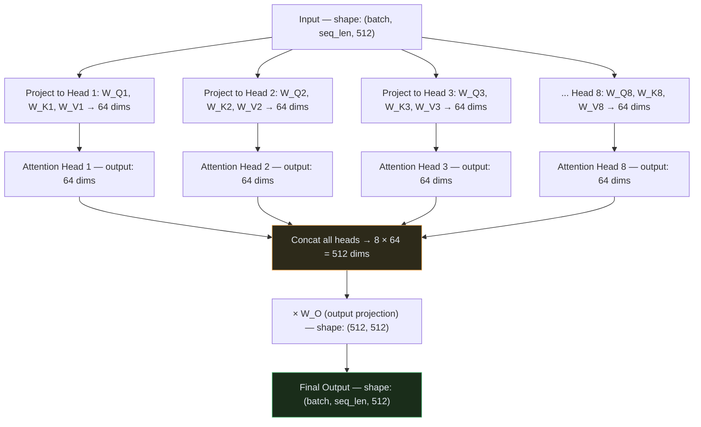
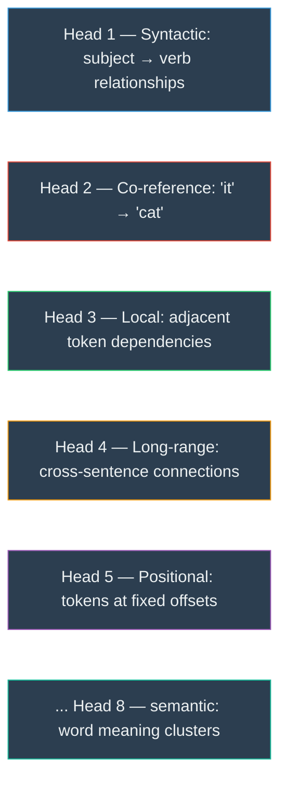
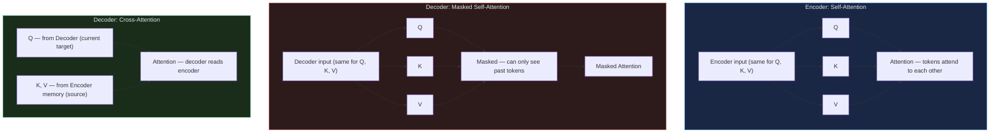

# Transformer — Module 03: Multi-Head Attention

> **Paper Section:** 3.2.2 — Multi-Head Attention
> **Previous:** [Module 02 — Scaled Dot-Product Attention](02_attention.md)
> **Next:** [Module 04 — Feed-Forward + Add & Norm](04_ffn_norm.md)

---

## 1. The Problem With a Single Attention Head

In Module 02, we built Scaled Dot-Product Attention. It works — but it can only learn **one relationship pattern** at a time.

Consider the sentence: **"The cat sat on the mat because it was tired."**

To fully understand this sentence, a model needs to track multiple relationships **simultaneously**:
- `it` refers to `cat` (co-reference)
- `sat` is the action performed by `cat` (subject-verb)
- `mat` is the location of `sat` (verb-object)
- `tired` describes the state of `cat` (adjective-subject)

A single attention head produces one set of weights — it can only focus on **one of these patterns** at a time.

> *"Multi-head attention allows the model to jointly attend to information from different representation subspaces at different positions. With a single attention head, averaging inhibits this."* — paper, Section 3.2.2

---

## 2. The Core Idea: Run Attention H Times in Parallel

Instead of running attention once with full `d_model=512` dimensions, split it into `h=8` smaller heads, each with `d_k = d_model/h = 64` dimensions.

Each head gets its own **independent learnable projection matrices** (W_Q, W_K, W_V), so each head learns to look for a **different type of relationship**.



Each head runs independently and in parallel — then the results are concatenated and projected back to `d_model`.

---

## 3. The Formula

```
MultiHead(Q, K, V) = Concat(head_1, ..., head_h) · W_O

where head_i = Attention(Q · W_Q_i, K · W_K_i, V · W_V_i)
```

**The learned weight matrices per head:**
- `W_Q_i`: shape `(d_model, d_k)` — projects Q to 64 dims for head i
- `W_K_i`: shape `(d_model, d_k)` — projects K to 64 dims for head i
- `W_V_i`: shape `(d_model, d_v)` — projects V to 64 dims for head i
- `W_O`:   shape `(h × d_v, d_model)` — projects concatenated output back to 512

**From the paper (base model):**
- `h = 8` heads
- `d_k = d_v = d_model / h = 512 / 8 = 64`

---

## 4. What Does Each Head Actually Learn?

Since each head has separate weight matrices, they specialize via training into different roles. Research has found heads tend to learn patterns like:



> [!NOTE]
> These specializations are not explicitly programmed — they emerge naturally during training because different heads are penalized on different aspects of the translation loss.

---

## 5. Self-Attention vs Cross-Attention

Multi-Head Attention is used in **three different places** in the Transformer, with different sources for Q, K, V:



| Where | Q from | K, V from | Purpose |
| :--- | :--- | :--- | :--- |
| **Encoder self-attention** | Encoder input | Encoder input (same) | Source tokens understand each other |
| **Decoder masked self-attention** | Decoder input | Decoder input (same) | Target tokens understand each other (past only) |
| **Decoder cross-attention** | Decoder | Encoder memory | Target tokens read the source |

The `MultiHeadAttention` class is identical for all three — only the inputs differ.

---

## 6. Implementation: Step by Step

The implementation trick is to **avoid a loop** over heads. Instead, we reshape the tensor to process all heads in one matrix multiply:

```mermaid
graph LR
    IN["Input (batch, seq, 512)"]
    IN --> PROJ["Linear projection → (batch, seq, 512)"]
    PROJ --> SPLIT["Reshape → (batch, seq, 8 heads, 64)"]
    SPLIT --> TRANS["Transpose → (batch, 8 heads, seq, 64)"]
    TRANS --> ATT["Scaled Dot-Product Attention — all 8 heads at once"]
    ATT --> BACK["Transpose back → (batch, seq, 8, 64)"]
    BACK --> MERGE["Reshape (concat) → (batch, seq, 512)"]
    MERGE --> OUT["Output projection W_O → (batch, seq, 512)"]

    style ATT fill:#2d2a1a,stroke:#f6ad55,color:#e2e8f0
    style OUT fill:#1a2d1a,stroke:#68d391,color:#e2e8f0
```



---

## 7. Full Code: Multi-Head Attention

```python
import torch
import torch.nn as nn
import math
import torch.nn.functional as F


class ScaledDotProductAttention(nn.Module):
    """From Module 02 — reused here as a component."""
    def __init__(self, dropout: float = 0.1):
        super().__init__()
        self.dropout = nn.Dropout(p=dropout)

    def forward(self, Q, K, V, mask=None):
        d_k = Q.size(-1)
        scores = torch.matmul(Q, K.transpose(-2, -1)) / math.sqrt(d_k)
        if mask is not None:
            scores = scores.masked_fill(mask == 0, float('-inf'))
        weights = F.softmax(scores, dim=-1)
        weights = self.dropout(weights)
        return torch.matmul(weights, V), weights


class MultiHeadAttention(nn.Module):
    """
    Implements equation (4) from the paper (Section 3.2.2):

        MultiHead(Q,K,V) = Concat(head_1,...,head_h) W_O
        where head_i = Attention(Q W_Q_i, K W_K_i, V W_V_i)
    """
    def __init__(self, d_model: int = 512, num_heads: int = 8, dropout: float = 0.1):
        """
        Args:
            d_model:   Total model dimension (512 in base model)
            num_heads: Number of parallel attention heads (8 in base model)
            dropout:   Dropout rate on attention weights
        """
        super().__init__()
        assert d_model % num_heads == 0, "d_model must be divisible by num_heads"

        self.d_model = d_model
        self.num_heads = num_heads
        self.d_k = d_model // num_heads   # 512 // 8 = 64 per head

        # ── Learnable projection matrices ─────────────────────────────────────
        # Instead of h separate (512×64) matrices, we use ONE (512×512) matrix
        # which is equivalent but runs as a single efficient matmul
        self.W_q = nn.Linear(d_model, d_model, bias=False)  # combines all W_Q_i
        self.W_k = nn.Linear(d_model, d_model, bias=False)  # combines all W_K_i
        self.W_v = nn.Linear(d_model, d_model, bias=False)  # combines all W_V_i
        self.W_o = nn.Linear(d_model, d_model, bias=False)  # output projection W_O

        self.attention = ScaledDotProductAttention(dropout=dropout)

    def split_into_heads(self, x: torch.Tensor, batch_size: int) -> torch.Tensor:
        """
        Reshape from (batch, seq_len, d_model) to (batch, num_heads, seq_len, d_k)
        so all heads run in parallel.
        """
        # (batch, seq_len, d_model) → (batch, seq_len, num_heads, d_k)
        x = x.view(batch_size, -1, self.num_heads, self.d_k)
        # → (batch, num_heads, seq_len, d_k)
        return x.transpose(1, 2)

    def combine_heads(self, x: torch.Tensor, batch_size: int) -> torch.Tensor:
        """
        Reverse of split_into_heads.
        (batch, num_heads, seq_len, d_k) → (batch, seq_len, d_model)
        """
        # (batch, num_heads, seq_len, d_k) → (batch, seq_len, num_heads, d_k)
        x = x.transpose(1, 2).contiguous()
        # (batch, seq_len, num_heads, d_k) → (batch, seq_len, d_model)
        return x.view(batch_size, -1, self.d_model)

    def forward(
        self,
        Q: torch.Tensor,
        K: torch.Tensor,
        V: torch.Tensor,
        mask: torch.Tensor = None
    ):
        """
        Args:
            Q:    Query  — shape (batch, seq_len_q, d_model)
            K:    Key    — shape (batch, seq_len_k, d_model)
            V:    Value  — shape (batch, seq_len_k, d_model)
            mask: Optional — shape (batch, 1, seq_len_q, seq_len_k)
                  Extra dim for broadcasting across all heads

        Returns:
            output:  shape (batch, seq_len_q, d_model)
            weights: shape (batch, num_heads, seq_len_q, seq_len_k)
        """
        batch_size = Q.size(0)

        # ── Step 1: Linear projection ─────────────────────────────────────────
        # (batch, seq_len, d_model) → (batch, seq_len, d_model)
        Q = self.W_q(Q)
        K = self.W_k(K)
        V = self.W_v(V)

        # ── Step 2: Split into heads ──────────────────────────────────────────
        # (batch, seq_len, d_model) → (batch, num_heads, seq_len, d_k)
        Q = self.split_into_heads(Q, batch_size)
        K = self.split_into_heads(K, batch_size)
        V = self.split_into_heads(V, batch_size)

        # ── Step 3: Run attention on ALL heads simultaneously ─────────────────
        # PyTorch handles the (batch, num_heads) leading dims automatically
        # output shape: (batch, num_heads, seq_len, d_k)
        x, weights = self.attention(Q, K, V, mask)

        # ── Step 4: Combine heads (concat) ────────────────────────────────────
        # (batch, num_heads, seq_len, d_k) → (batch, seq_len, d_model)
        x = self.combine_heads(x, batch_size)

        # ── Step 5: Final output projection W_O ──────────────────────────────
        # (batch, seq_len, d_model) → (batch, seq_len, d_model)
        output = self.W_o(x)

        return output, weights


# ── Demonstration ─────────────────────────────────────────────────────────────
if __name__ == "__main__":
    torch.manual_seed(42)

    batch_size = 2
    seq_len    = 5      # "The cat sat on mat"
    d_model    = 512
    num_heads  = 8

    mha = MultiHeadAttention(d_model=d_model, num_heads=num_heads, dropout=0.0)
    print(f"Total parameters in MHA: {sum(p.numel() for p in mha.parameters()):,}")
    # W_q + W_k + W_v + W_o = 4 × (512×512) = 4 × 262,144 = 1,048,576 params

    # ── Example 1: Self-Attention (Q, K, V from same source) ──────────────────
    x = torch.randn(batch_size, seq_len, d_model)  # Encoder input
    out_self, weights_self = mha(Q=x, K=x, V=x)

    print(f"\nSelf-Attention:")
    print(f"  Input:   {x.shape}")            # (2, 5, 512)
    print(f"  Output:  {out_self.shape}")     # (2, 5, 512)
    print(f"  Weights: {weights_self.shape}") # (2, 8, 5, 5) — 8 heads, 5×5 attention maps

    # ── Example 2: Cross-Attention (Q from Decoder, K/V from Encoder) ─────────
    encoder_memory = torch.randn(batch_size, 7, d_model)  # Encoder output (length 7)
    decoder_query  = torch.randn(batch_size, 3, d_model)  # Decoder state (length 3)

    out_cross, weights_cross = mha(Q=decoder_query, K=encoder_memory, V=encoder_memory)

    print(f"\nCross-Attention:")
    print(f"  Query (decoder): {decoder_query.shape}")    # (2, 3, 512)
    print(f"  Key/Val (encoder): {encoder_memory.shape}") # (2, 7, 512)
    print(f"  Output:  {out_cross.shape}")                # (2, 3, 512)
    print(f"  Weights: {weights_cross.shape}")            # (2, 8, 3, 7)

    # ── Example 3: Masked Self-Attention (Decoder) ────────────────────────────
    seq = 5
    mask = torch.tril(torch.ones(seq, seq)).unsqueeze(0).unsqueeze(0)
    # Shape: (1, 1, seq, seq) — broadcasts across batch and heads

    out_masked, weights_masked = mha(Q=x, K=x, V=x, mask=mask)

    print(f"\nMasked Self-Attention:")
    print(f"  Output: {out_masked.shape}")    # (2, 5, 512)
    print(f"  Mask shape: {mask.shape}")      # (1, 1, 5, 5)

    # Upper triangle of each head should be ~0
    print(f"  weights_masked[0, head_0]:")
    print(weights_masked[0, 0].detach().numpy().round(3))
    # Expected: upper-right triangle is zero
```

---

## 8. Visualizing Multiple Heads

After training, different heads specialize in different patterns. We can visualize this by plotting the attention weight matrices:

```python
import matplotlib.pyplot as plt

def visualize_attention_heads(weights, tokens, title="Multi-Head Attention"):
    """
    weights: shape (num_heads, seq_len, seq_len)
    tokens:  list of token strings
    """
    num_heads = weights.shape[0]
    fig, axes = plt.subplots(2, 4, figsize=(16, 8))
    fig.suptitle(title, fontsize=14)

    for head_idx, ax in enumerate(axes.flat):
        if head_idx >= num_heads:
            break
        im = ax.imshow(weights[head_idx].detach().numpy(), cmap='Blues', vmin=0, vmax=1)
        ax.set_xticks(range(len(tokens)))
        ax.set_yticks(range(len(tokens)))
        ax.set_xticklabels(tokens, rotation=45, fontsize=8)
        ax.set_yticklabels(tokens, fontsize=8)
        ax.set_title(f"Head {head_idx + 1}")
        plt.colorbar(im, ax=ax)

    plt.tight_layout()
    plt.savefig("attention_heads.png", dpi=150)
    plt.show()

# Usage
tokens = ["The", "cat", "sat", "on", "mat"]
x = torch.randn(1, 5, 512)
mha = MultiHeadAttention(d_model=512, num_heads=8, dropout=0.0)
_, weights = mha(x, x, x)                  # (1, 8, 5, 5)
visualize_attention_heads(weights[0], tokens)  # (8, 5, 5)
```

---

## 9. Parameter Count

Understanding how many parameters are in Multi-Head Attention:

| Matrix | Shape | Parameters |
| :--- | :--- | :--- |
| W_Q (combined) | (512 × 512) | 262,144 |
| W_K (combined) | (512 × 512) | 262,144 |
| W_V (combined) | (512 × 512) | 262,144 |
| W_O | (512 × 512) | 262,144 |
| **Total** | | **1,048,576 (~1M)** |

With N=6 encoder layers + 6 decoder layers (× 3 attention blocks per decoder layer):
- Encoder: 6 × 1M = ~6M params in attention
- Decoder: 6 × 3 × 1M = ~18M params in attention
- **Total attention params: ~24M** (out of the base model's ~65M total)

---

## 10. Key Takeaways

| Concept | Key Point |
| :--- | :--- |
| **Why multi-head?** | Single head can only learn one relationship type; multiple heads learn many simultaneously |
| **h=8 heads, d_k=64** | Split 512-dim space into 8 independent 64-dim subspaces |
| **Each head is independent** | Separate W_Q, W_K, W_V per head — specialized via training |
| **Efficient implementation** | Reshape + transpose avoids a slow Python loop over heads |
| **Three attention types** | Same class, different Q/K/V sources: self, masked self, cross |
| **Output shape** | Always `(batch, seq_len, d_model)` — shape is preserved |

> [!IMPORTANT]
> The output of `MultiHeadAttention` is **not** the final output of an Encoder/Decoder layer. It still needs to pass through the **Add & Norm** (residual connection + layer normalization) and a **Feed-Forward Network**. That is Module 04.

---

## 11. What's Next

| Next | Topic |
| :--- | :--- |
| `04_ffn_norm.md` | Feed-Forward Network + Residual Connections + Layer Normalization |
