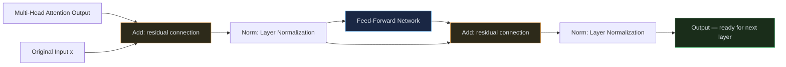
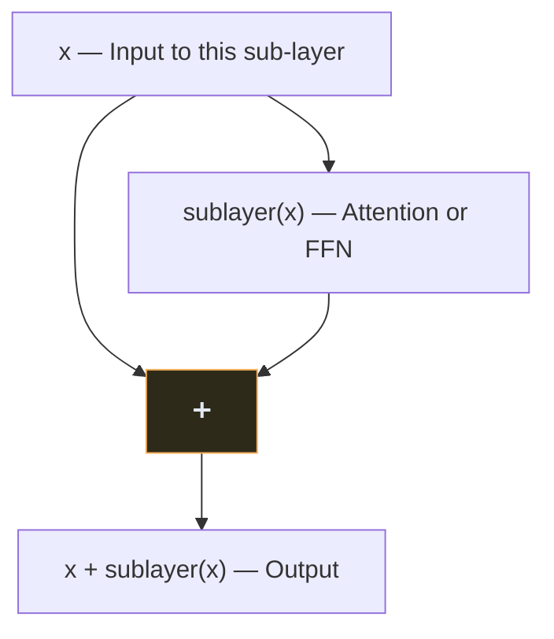
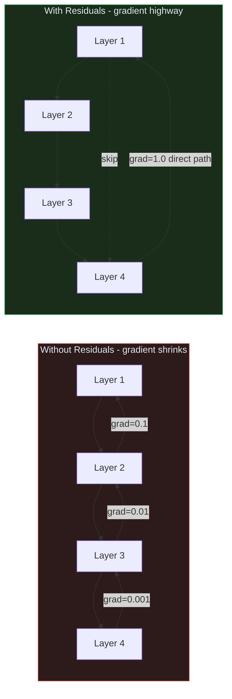
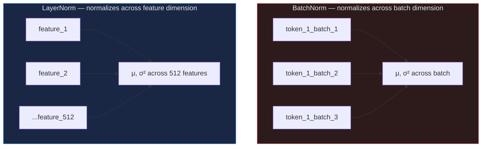
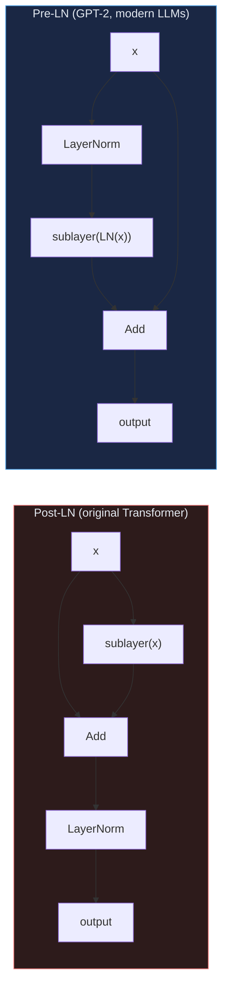
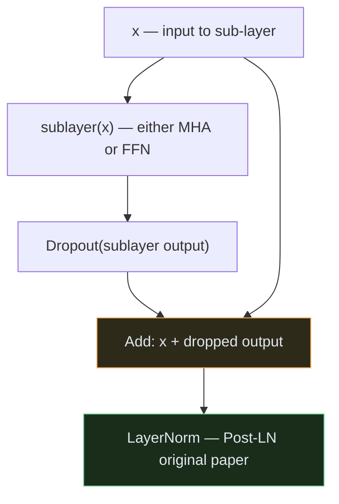

# Transformer — Module 04: Feed-Forward Network + Add & Norm

> **Paper Section:** 3.3 — Position-wise Feed-Forward Networks, 5.4 — Regularization
> **Previous:** [Module 03 — Multi-Head Attention](03_multihead.md)
> **Next:** [Module 05 — Full Encoder Block](05_encoder.md)

---

## 1. Where We Are

After Multi-Head Attention, each token has gathered information from its relevant neighbours. But that information is still a **linear combination of value vectors** — the model hasn't done any nonlinear transformation yet.

This module covers the two operations applied **after** attention in every Encoder/Decoder layer:



Both the Add (residual) and the Norm (layer normalization) appear **twice** in each Encoder layer — once after attention, once after the FFN.

---

## 2. Feed-Forward Network (FFN)

### What is it?

The FFN is a simple two-layer neural network applied **independently and identically** to each token position.

**From the paper, Section 3.3:**
```
FFN(x) = max(0, x · W₁ + b₁) · W₂ + b₂
```

In plain English:
1. **Linear up-projection**: expand from 512 → 2048 dimensions (`W₁`)
2. **ReLU activation**: nonlinear transformation ← the only nonlinearity in the whole model
3. **Linear down-projection**: compress back from 2048 → 512 dimensions (`W₂`)


### Why "Position-wise"?

The word **"position-wise"** in the paper means the **same FFN** (same `W₁`, `W₂`, `b₁`, `b₂`) is applied independently to each token position.

```
Token 1 → FFN → Output 1
Token 2 → FFN → Output 2     ← Same weight matrices, but no interaction between positions
Token 3 → FFN → Output 3
```

This is different from attention, which mixes all positions together. Attention does the **"gathering"** step; FFN does the **"processing"** step for each token individually.

### Why Expand to 2048 (4× d_model)?

The ratio `d_ff / d_model = 4` is a design choice from the paper. The intuition:

- A small inner dimension would be a bottleneck — not enough capacity to transform the information.
- Research has found that 4× expansion works well empirically.
- The FFN's inner layer acts as a **"memory"** that stores associations. Wider FFNs store more associations.

> **Interesting finding from later research (Geva et al., 2021):** Each row of `W₂` can be seen as a "memory slot" — the FFN learns to retrieve stored factual knowledge through its key-value structure. This is one reason FFNs in LLMs store so much world knowledge.

### Parameter Count

| Layer | Shape | Parameters |
| :--- | :--- | :--- |
| W₁ + b₁ | (512 × 2048) + 2048 | 1,050,624 |
| W₂ + b₂ | (2048 × 512) + 512 | 1,049,088 |
| **Total per layer** | | **~2.1M** |

With 6 encoder + 6 decoder layers: `12 × 2.1M ≈ 25M params` in FFN (slightly more than the ~24M in attention).

---

## 3. Residual Connections (Add)

### The Problem: Vanishing Gradients in Deep Networks

When you stack 6 or 12 layers, gradients must travel backwards through all of them during training. With each layer, gradients can **shrink exponentially** — by the time they reach the early layers, they are nearly zero.

Early layers stop learning → model becomes shallow in practice despite being architecturally deep.

### The Solution: Residual Connections

Introduced by **He et al. (2016)** in ResNets for image models, and adopted by the Transformer:

```
output = x + sublayer(x)
```

Instead of replacing `x` with `sublayer(x)`, we **add** the original `x` back.



**Why this works — the gradient highway:**

During backpropagation, gradients flow through both paths:
1. Through `sublayer(x)` — potentially shrinking
2. **Directly through `x`** — no transformation, gradient passes unchanged ← the highway

```
Gradient at output:  ∂L/∂out = ∂L/∂out × (∂sublayer/∂x + 1)
                                                              ↑
                                              This "1" ensures gradient never vanishes
```

Even if `∂sublayer/∂x` is near zero, the total gradient is at least `∂L/∂out × 1` — a direct, unobstructed path. Gradients can always reach early layers.

**Visual intuition:**



---

## 4. Layer Normalization (Norm)

### The Problem: Internal Covariate Shift

As inputs pass through layers, their distributions shift — each layer must constantly adapt to changing input statistics. This slows training and causes instability.

### The Solution: Layer Normalization

**Layer Normalization** (Ba et al., 2016) normalizes the activations across the `d_model` dimension for each token independently.

**Formula:**
```
LayerNorm(x) = γ · (x - μ) / √(σ² + ε) + β
```

Where:
- `μ` = mean across all `d_model=512` features for this token
- `σ²` = variance across all features for this token
- `γ`, `β` = learned scale and shift parameters (one per feature)
- `ε` = small constant (e.g., 1e-6) to prevent division by zero


### LayerNorm vs BatchNorm

This is often confused. The key difference is **what dimension** you normalize over:

```
Input shape: (batch_size, seq_len, d_model)

BatchNorm: normalizes over (batch_size, seq_len) for each feature  ← depends on batch
LayerNorm: normalizes over (d_model) for each token                 ← independent of batch
```



**Why LayerNorm (not BatchNorm) for Transformers?**
1. NLP sequences have variable lengths — batch statistics are meaningless
2. At inference time, batch size is often 1 — BatchNorm's statistics are unstable
3. LayerNorm works on a single token independently — no batch dependency

---

## 5. Post-LN vs Pre-LN

The original paper uses **Post-LN**: normalize after adding the residual.

```
Post-LN (original paper):   x → sublayer → add residual → LayerNorm
Pre-LN (modern models):     x → LayerNorm → sublayer → add residual
```



**Pre-LN advantages (why modern models use it):**
- More stable training — no need for learning rate warmup
- Better gradient flow — normalization happens before the sublayer
- GPT-2, GPT-3, LLaMA, and most modern LLMs all use Pre-LN

**We will implement both** — but note that the original paper uses Post-LN.

---

## 6. Full Code

```python
import torch
import torch.nn as nn
import torch.nn.functional as F


# ─────────────────────────────────────────────────────────────────────────────
# Component 1: Feed-Forward Network
# ─────────────────────────────────────────────────────────────────────────────

class FeedForward(nn.Module):
    """
    Position-wise Feed-Forward Network (Section 3.3):
        FFN(x) = max(0, x·W₁ + b₁)·W₂ + b₂
    """
    def __init__(self, d_model: int = 512, d_ff: int = 2048, dropout: float = 0.1):
        """
        Args:
            d_model: Input/output dimension (512)
            d_ff:    Inner hidden dimension (2048 = 4 × d_model)
            dropout: Applied after ReLU (paper Section 5.4)
        """
        super().__init__()
        self.linear1 = nn.Linear(d_model, d_ff)   # W₁: 512 → 2048
        self.linear2 = nn.Linear(d_ff, d_model)   # W₂: 2048 → 512
        self.dropout  = nn.Dropout(p=dropout)

    def forward(self, x: torch.Tensor) -> torch.Tensor:
        """
        Args:
            x: shape (batch, seq_len, d_model)
        Returns:
            shape (batch, seq_len, d_model)  — same shape preserved
        """
        # Step 1: Up-projection + ReLU
        x = F.relu(self.linear1(x))    # (batch, seq, d_model) → (batch, seq, d_ff)

        # Step 2: Dropout (paper uses dropout on FFN inner activations)
        x = self.dropout(x)

        # Step 3: Down-projection
        x = self.linear2(x)            # (batch, seq, d_ff) → (batch, seq, d_model)

        return x


# ─────────────────────────────────────────────────────────────────────────────
# Component 2: Add & Norm (Residual + Layer Normalization)
# ─────────────────────────────────────────────────────────────────────────────

class AddAndNorm(nn.Module):
    """
    Sublayer wrapper implementing:
        output = LayerNorm(x + Dropout(sublayer(x)))

    This is the Post-LN variant from the original paper.
    """
    def __init__(self, d_model: int = 512, dropout: float = 0.1):
        super().__init__()
        self.norm    = nn.LayerNorm(d_model)
        self.dropout = nn.Dropout(p=dropout)

    def forward(self, x: torch.Tensor, sublayer_output: torch.Tensor) -> torch.Tensor:
        """
        Args:
            x:               Original input (residual)
            sublayer_output: Output of attention or FFN
        Returns:
            LayerNorm(x + Dropout(sublayer_output))
        """
        return self.norm(x + self.dropout(sublayer_output))


class PreNormAddAndNorm(nn.Module):
    """
    Pre-LN variant (used in GPT-2, LLaMA, modern LLMs):
        output = x + Dropout(sublayer(LayerNorm(x)))

    More stable training. The sublayer function is passed in as a callable.
    """
    def __init__(self, d_model: int = 512, dropout: float = 0.1):
        super().__init__()
        self.norm    = nn.LayerNorm(d_model)
        self.dropout = nn.Dropout(p=dropout)

    def forward(self, x: torch.Tensor, sublayer) -> torch.Tensor:
        """
        Args:
            x:        Input tensor
            sublayer: A callable (e.g., lambda x: mha(x, x, x))
        Returns:
            x + Dropout(sublayer(LayerNorm(x)))
        """
        return x + self.dropout(sublayer(self.norm(x)))


# ─────────────────────────────────────────────────────────────────────────────
# Demonstration
# ─────────────────────────────────────────────────────────────────────────────

if __name__ == "__main__":
    torch.manual_seed(42)

    batch_size = 2
    seq_len    = 5
    d_model    = 512
    d_ff       = 2048

    x = torch.randn(batch_size, seq_len, d_model)

    # ── Test FeedForward ──────────────────────────────────────────────────────
    ffn = FeedForward(d_model=d_model, d_ff=d_ff, dropout=0.0)

    ffn_out = ffn(x)
    print(f"FFN input:  {x.shape}")       # (2, 5, 512)
    print(f"FFN output: {ffn_out.shape}") # (2, 5, 512) — same shape

    ffn_params = sum(p.numel() for p in ffn.parameters())
    print(f"FFN parameters: {ffn_params:,}")  # ~2.1M

    # ── Test AddAndNorm (Post-LN) ─────────────────────────────────────────────
    add_norm = AddAndNorm(d_model=d_model, dropout=0.0)

    # Simulate: x is the "before FFN" tensor, ffn_out is the FFN output
    layer_out = add_norm(x, ffn_out)
    print(f"\nPost-LN Add&Norm output: {layer_out.shape}")  # (2, 5, 512)

    # Verify normalization: each token's features should have mean≈0, std≈1
    sample_token = layer_out[0, 0].detach()  # First token of first sentence
    print(f"Token feature mean: {sample_token.mean():.4f}")  # ≈ 0.0
    print(f"Token feature std:  {sample_token.std():.4f}")   # ≈ 1.0

    # ── Test PreNorm ──────────────────────────────────────────────────────────
    pre_norm = PreNormAddAndNorm(d_model=d_model, dropout=0.0)

    # Usage: pass the sublayer as a callable
    pre_norm_out = pre_norm(x, sublayer=lambda z: ffn(z))
    print(f"\nPre-LN Add&Norm output: {pre_norm_out.shape}")  # (2, 5, 512)

    # ── Compare before and after normalization ────────────────────────────────
    print(f"\nBefore LayerNorm — mean: {x[0,0].mean():.3f}, std: {x[0,0].std():.3f}")
    normed = nn.LayerNorm(d_model)(x)
    print(f"After  LayerNorm — mean: {normed[0,0].mean():.3f}, std: {normed[0,0].std():.3f}")
    # Before: arbitrary mean/std
    # After:  mean≈0, std≈1 (before γ/β learned scaling)
```

---

## 7. Putting It Together: One Sub-Layer Block

Each sub-layer inside an Encoder/Decoder layer follows this exact pattern:



And in a single Encoder layer, this pattern appears **twice**:

```
Input x
  → [Multi-Head Self-Attention] → Add & Norm → intermediate
  → [Feed-Forward Network]      → Add & Norm → output for next layer
```

---

## 8. Key Takeaways

| Concept | Key Point |
| :--- | :--- |
| **FFN formula** | `FFN(x) = max(0, xW₁+b₁)W₂+b₂` — expand then compress |
| **d_ff = 2048** | 4× d_model — empirically optimal trade-off of capacity vs cost |
| **Position-wise** | Same FFN applied independently to each token — no cross-token mixing |
| **ReLU** | The only nonlinearity in the entire Transformer — without it, the model is just linear |
| **Residual connection** | `x + sublayer(x)` — gradient highway that enables deep stacking |
| **Layer Normalization** | Normalizes over d_model features per token — batch-independent |
| **Post-LN vs Pre-LN** | Paper uses Post-LN; modern LLMs (GPT, LLaMA) use Pre-LN for stability |

> [!IMPORTANT]
> The Add & Norm pattern is **the glue** of the Transformer. Without residual connections, you couldn't stack 6 (or 96, or 200) layers. Without layer normalization, training would be unstable. These two operations are what make deep Transformers trainable.

---

## 9. What's Next

We now have all four building blocks:
- ✅ Module 01: Input Embedding + Positional Encoding
- ✅ Module 02: Scaled Dot-Product Attention
- ✅ Module 03: Multi-Head Attention
- ✅ Module 04: FFN + Add & Norm

In the next module, we **assemble all of these** into a complete Encoder block and stack 6 of them.

| Next | Topic |
| :--- | :--- |
| `05_encoder.md` | Full Encoder Block — assembling all modules into one complete stack |
