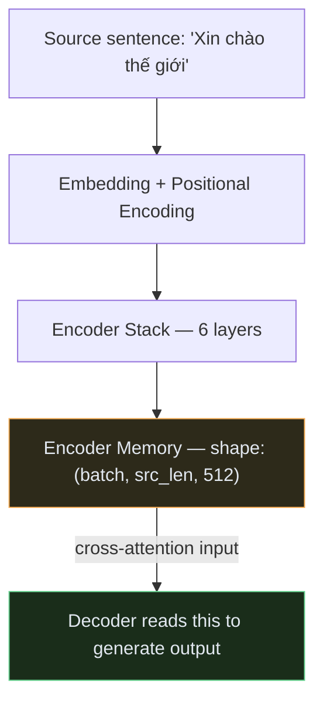
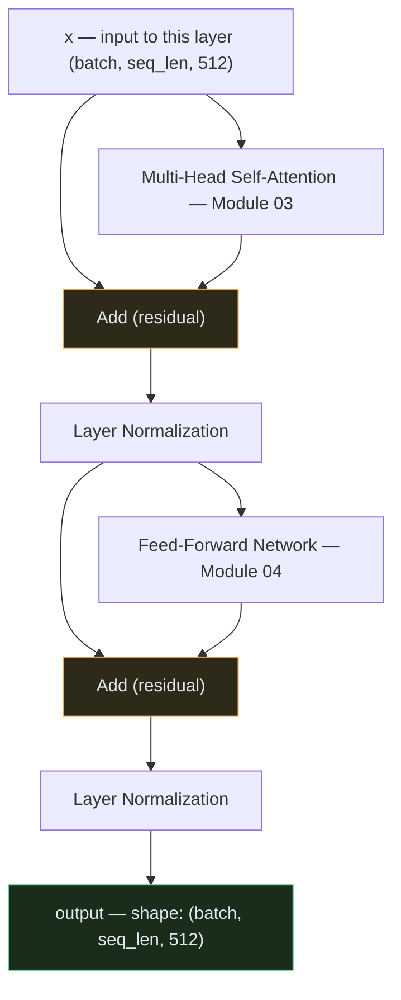
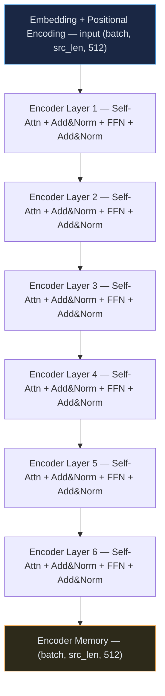
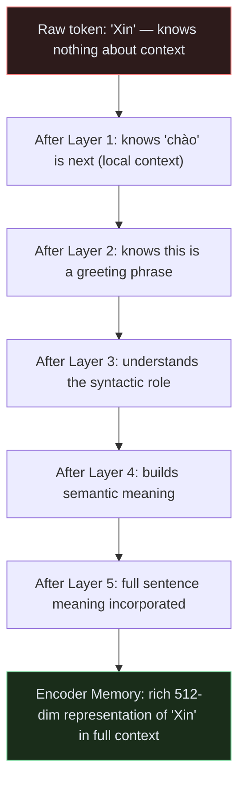

# Transformer — Module 05: Full Encoder Block

> **Paper Section:** 3.1 — Encoder and Decoder Stacks (Encoder part)
> **Previous:** [Module 04 — FFN + Add & Norm](04_ffn_norm.md)
> **Next:** [Module 06 — Full Decoder Block](06_decoder.md)

---

## 1. What is the Encoder?

The Encoder's job is to **read and understand** the input sequence (e.g., the source sentence in translation). It converts a sequence of token vectors into a sequence of **rich, context-aware representations** — called the **Encoder Memory**.

This memory is later read by the Decoder through cross-attention.



---

## 2. One Encoder Layer — Internal Structure

Each of the 6 Encoder layers performs exactly the same two operations:



**The two sub-layers:**

| Sub-layer | Operation | Purpose |
| :--- | :--- | :--- |
| **Sub-layer 1** | Multi-Head Self-Attention + Add & Norm | Tokens gather context from each other |
| **Sub-layer 2** | Feed-Forward Network + Add & Norm | Each token transforms its gathered context |

**Key insight:** Attention does the *mixing* (information flows between tokens). FFN does the *thinking* (nonlinear transformation per token). Together they form a complete reasoning step.

---

## 3. Stacking 6 Encoder Layers

The full Encoder is 6 identical layers stacked in sequence. The output of layer N is the input to layer N+1.



**Why 6 layers?** Each layer refines the representation:
- **Early layers** (1–2): Build local relationships — which words are near each other
- **Middle layers** (3–4): Build syntactic structure — subjects, verbs, objects
- **Late layers** (5–6): Build semantic meaning — what the sentence *means*

This is an empirical finding — deeper encoders produce richer representations, with diminishing returns beyond 6–12 layers for typical tasks.

---

## 4. Shape Tracking Through the Encoder

One of the Transformer's elegant properties: **shape never changes** through the encoder stack.

```
Input tokens:                (batch, src_len)        e.g., (2, 7)
After embedding:             (batch, src_len, 512)   e.g., (2, 7, 512)
After Encoder Layer 1:       (batch, src_len, 512)   still (2, 7, 512)
After Encoder Layer 2:       (batch, src_len, 512)   still (2, 7, 512)
...
After Encoder Layer 6:       (batch, src_len, 512)   still (2, 7, 512)
                                      ↑
                             The shape NEVER changes through the encoder stack.
                             Only the VALUE of each vector changes (gets richer).
```

---

## 5. Full Code: Encoder Layer + Encoder Stack

```python
import copy
import torch
import torch.nn as nn
import math
import torch.nn.functional as F


# ── Re-use from previous modules ──────────────────────────────────────────────
# (In a real project, these would be imported from their respective modules)

class ScaledDotProductAttention(nn.Module):
    def __init__(self, dropout=0.1):
        super().__init__()
        self.dropout = nn.Dropout(p=dropout)

    def forward(self, Q, K, V, mask=None):
        d_k = Q.size(-1)
        scores = torch.matmul(Q, K.transpose(-2, -1)) / math.sqrt(d_k)
        if mask is not None:
            scores = scores.masked_fill(mask == 0, float('-inf'))
        weights = F.softmax(scores, dim=-1)
        weights = self.dropout(weights)
        return torch.matmul(weights, V), weights


class MultiHeadAttention(nn.Module):
    def __init__(self, d_model=512, num_heads=8, dropout=0.1):
        super().__init__()
        assert d_model % num_heads == 0
        self.d_model = d_model
        self.num_heads = num_heads
        self.d_k = d_model // num_heads
        self.W_q = nn.Linear(d_model, d_model, bias=False)
        self.W_k = nn.Linear(d_model, d_model, bias=False)
        self.W_v = nn.Linear(d_model, d_model, bias=False)
        self.W_o = nn.Linear(d_model, d_model, bias=False)
        self.attention = ScaledDotProductAttention(dropout=dropout)

    def split_heads(self, x, batch_size):
        return x.view(batch_size, -1, self.num_heads, self.d_k).transpose(1, 2)

    def combine_heads(self, x, batch_size):
        return x.transpose(1, 2).contiguous().view(batch_size, -1, self.d_model)

    def forward(self, Q, K, V, mask=None):
        b = Q.size(0)
        Q, K, V = self.split_heads(self.W_q(Q), b), self.split_heads(self.W_k(K), b), self.split_heads(self.W_v(V), b)
        x, weights = self.attention(Q, K, V, mask)
        return self.W_o(self.combine_heads(x, b)), weights


class FeedForward(nn.Module):
    def __init__(self, d_model=512, d_ff=2048, dropout=0.1):
        super().__init__()
        self.linear1 = nn.Linear(d_model, d_ff)
        self.linear2 = nn.Linear(d_ff, d_model)
        self.dropout  = nn.Dropout(p=dropout)

    def forward(self, x):
        return self.linear2(self.dropout(F.relu(self.linear1(x))))


class TokenEmbedding(nn.Module):
    def __init__(self, vocab_size, d_model):
        super().__init__()
        self.embedding = nn.Embedding(vocab_size, d_model)
        self.d_model = d_model

    def forward(self, x):
        return self.embedding(x) * math.sqrt(self.d_model)


class PositionalEncoding(nn.Module):
    def __init__(self, d_model, max_seq_len=5000, dropout=0.1):
        super().__init__()
        self.dropout = nn.Dropout(p=dropout)
        pe = torch.zeros(max_seq_len, d_model)
        position = torch.arange(0, max_seq_len).unsqueeze(1).float()
        div_term = torch.exp(torch.arange(0, d_model, 2).float() * (-math.log(10000.0) / d_model))
        pe[:, 0::2] = torch.sin(position * div_term)
        pe[:, 1::2] = torch.cos(position * div_term)
        self.register_buffer('pe', pe.unsqueeze(0))

    def forward(self, x):
        return self.dropout(x + self.pe[:, :x.size(1), :])


# ─────────────────────────────────────────────────────────────────────────────
# NEW: Encoder Layer
# ─────────────────────────────────────────────────────────────────────────────

class EncoderLayer(nn.Module):
    """
    One single Encoder layer containing:
        1. Multi-Head Self-Attention  + Add & Norm
        2. Feed-Forward Network       + Add & Norm
    """
    def __init__(self, d_model: int = 512, num_heads: int = 8,
                 d_ff: int = 2048, dropout: float = 0.1):
        super().__init__()

        # Sub-layer 1: Self-Attention
        self.self_attention = MultiHeadAttention(d_model, num_heads, dropout)

        # Sub-layer 2: Feed-Forward
        self.feed_forward = FeedForward(d_model, d_ff, dropout)

        # Two Add & Norm blocks (one per sub-layer)
        self.norm1   = nn.LayerNorm(d_model)
        self.norm2   = nn.LayerNorm(d_model)
        self.dropout = nn.Dropout(p=dropout)

    def forward(self, x: torch.Tensor, src_mask: torch.Tensor = None):
        """
        Args:
            x:        Input — shape (batch, src_len, d_model)
            src_mask: Optional padding mask — shape (batch, 1, 1, src_len)
                      Used to ignore <pad> tokens. Not the causal mask.
        Returns:
            Output — shape (batch, src_len, d_model)
        """
        # ── Sub-layer 1: Self-Attention ───────────────────────────────────────
        # In self-attention: Q = K = V = x (all from the same source)
        attn_output, _ = self.self_attention(Q=x, K=x, V=x, mask=src_mask)

        # Add & Norm (Post-LN as in the original paper)
        x = self.norm1(x + self.dropout(attn_output))

        # ── Sub-layer 2: Feed-Forward ─────────────────────────────────────────
        ffn_output = self.feed_forward(x)

        # Add & Norm
        x = self.norm2(x + self.dropout(ffn_output))

        return x  # shape: (batch, src_len, d_model)


# ─────────────────────────────────────────────────────────────────────────────
# NEW: Full Encoder Stack
# ─────────────────────────────────────────────────────────────────────────────

class Encoder(nn.Module):
    """
    Full Transformer Encoder:
        Embedding + Positional Encoding → N × EncoderLayer
    """
    def __init__(
        self,
        vocab_size: int,
        d_model:    int   = 512,
        num_heads:  int   = 8,
        num_layers: int   = 6,
        d_ff:       int   = 2048,
        max_seq_len: int  = 5000,
        dropout:    float = 0.1,
    ):
        super().__init__()
        self.token_embedding = TokenEmbedding(vocab_size, d_model)
        self.positional_encoding = PositionalEncoding(d_model, max_seq_len, dropout)

        # Stack N identical encoder layers
        # Use deepcopy to ensure each layer has independent weights
        self.layers = nn.ModuleList([
            EncoderLayer(d_model, num_heads, d_ff, dropout)
            for _ in range(num_layers)
        ])

        self.num_layers = num_layers

    def forward(self, src: torch.Tensor, src_mask: torch.Tensor = None):
        """
        Args:
            src:      Token IDs — shape (batch, src_len)
            src_mask: Optional padding mask — shape (batch, 1, 1, src_len)
        Returns:
            Encoder memory — shape (batch, src_len, d_model)
        """
        # Step 1: Embed tokens + add positional encoding
        x = self.token_embedding(src)        # (batch, src_len) → (batch, src_len, d_model)
        x = self.positional_encoding(x)      # add position info + dropout

        # Step 2: Pass through N encoder layers sequentially
        for layer in self.layers:
            x = layer(x, src_mask)

        # Output is the Encoder Memory
        return x   # shape: (batch, src_len, d_model)


# ── Demonstration ─────────────────────────────────────────────────────────────
if __name__ == "__main__":
    torch.manual_seed(42)

    # Hyperparameters (base model from paper)
    VOCAB_SIZE  = 30000
    D_MODEL     = 512
    NUM_HEADS   = 8
    NUM_LAYERS  = 6
    D_FF        = 2048
    DROPOUT     = 0.1

    encoder = Encoder(
        vocab_size   = VOCAB_SIZE,
        d_model      = D_MODEL,
        num_heads    = NUM_HEADS,
        num_layers   = NUM_LAYERS,
        d_ff         = D_FF,
        dropout      = DROPOUT,
    )

    # Parameter count
    total_params = sum(p.numel() for p in encoder.parameters())
    print(f"Encoder total parameters: {total_params:,}")
    # Expected: ~32M
    # Breakdown:
    #   Embedding:        30000 × 512     = 15,360,000
    #   Per layer MHA:    4 × 512 × 512   = 1,048,576
    #   Per layer FFN:    2 × (512×2048)  = 2,097,152
    #   Per layer norms:  4 × 512         = 2,048
    #   × 6 layers:       6 × ~3.1M       = ~18.9M
    #   Total ≈ 15.36M + 18.9M = ~34M

    # ── Forward pass ──────────────────────────────────────────────────────────
    batch_size = 2
    src_len    = 7   # "Xin chào thế giới <pad> <pad> <pad>"

    src_tokens = torch.randint(0, VOCAB_SIZE, (batch_size, src_len))

    # Padding mask: tell the model which positions are <pad> (token ID = 0 usually)
    # Shape: (batch, 1, 1, src_len) — broadcasts over (batch, heads, seq_q, seq_k)
    pad_token_id = 0
    src_mask = (src_tokens != pad_token_id).unsqueeze(1).unsqueeze(2)
    # Shape: (2, 1, 1, 7) — True where real token, False where <pad>

    encoder.eval()
    with torch.no_grad():
        encoder_memory = encoder(src_tokens, src_mask)

    print(f"\nInput token IDs:  {src_tokens.shape}")     # (2, 7)
    print(f"Encoder Memory:   {encoder_memory.shape}")  # (2, 7, 512)

    # Verify: each token position has a 512-dimensional vector
    print(f"\nFirst token vector (first 5 dims): {encoder_memory[0, 0, :5].tolist()}")
    print(f"Last  token vector (first 5 dims): {encoder_memory[0, -1, :5].tolist()}")
    # These are now context-aware — "Xin" knows about "chào" and vice versa
```

---

## 6. What the Encoder Memory Contains

After 6 layers, each position in the encoder memory is no longer just the embedding of a single token — it's a **rich, context-aware representation** that encodes:



---

## 7. Padding Mask — Handling Variable Length Sequences

In a batch, sentences have different lengths. Shorter sentences are padded with a special `<pad>` token to match the longest sentence.

We must tell the attention mechanism: **"ignore these padded positions — don't attend to them."**

```python
# Example batch:
# Sentence 1: "Xin chào thế giới"          → IDs: [4, 12, 78, 55]
# Sentence 2: "Cảm ơn <pad> <pad>"         → IDs: [9, 33,  0,  0]
#                                                               ↑ padding

src_tokens = torch.tensor([
    [4, 12, 78, 55],   # Sentence 1 — all real tokens
    [9, 33,  0,  0],   # Sentence 2 — padded with 0
])

# Mask: True = real token, False = padding
src_mask = (src_tokens != 0).unsqueeze(1).unsqueeze(2)
# Shape: (batch=2, 1, 1, seq_len=4)
# Value: [[[[True, True, True, True]],
#          [[True, True, False, False]]]]

# In ScaledDotProductAttention, False positions get -inf before softmax
# → softmax(-inf) = 0.0 → zero attention weight on padding positions
```

---

## 8. Key Takeaways

| Concept | Key Point |
| :--- | :--- |
| **Encoder purpose** | Read and understand source — produce context-aware token representations |
| **One layer** | Self-Attention + Add&Norm + FFN + Add&Norm |
| **6 layers stacked** | Each layer refines: local → syntactic → semantic understanding |
| **Shape invariance** | Input shape = Output shape throughout entire encoder stack |
| **Self-attention in encoder** | Q = K = V from the same source — no mask needed (all tokens see all) |
| **Padding mask** | Prevents attention to `<pad>` positions in variable-length batches |
| **Encoder Memory** | The output — 6-layer-refined representation passed to Decoder via cross-attention |

> [!NOTE]
> The encoder has **no causal mask** — every token can freely attend to every other token in both directions. This is the key reason encoder-only models like **BERT** are excellent for understanding tasks (classification, NER, QA) — they have full bidirectional context.

---

## 9. What's Next

The Encoder produces its memory. The Decoder will consume it.

| Next | Topic |
| :--- | :--- |
| `06_decoder.md` | Full Decoder Block — Masked Self-Attention + Cross-Attention + FFN |
