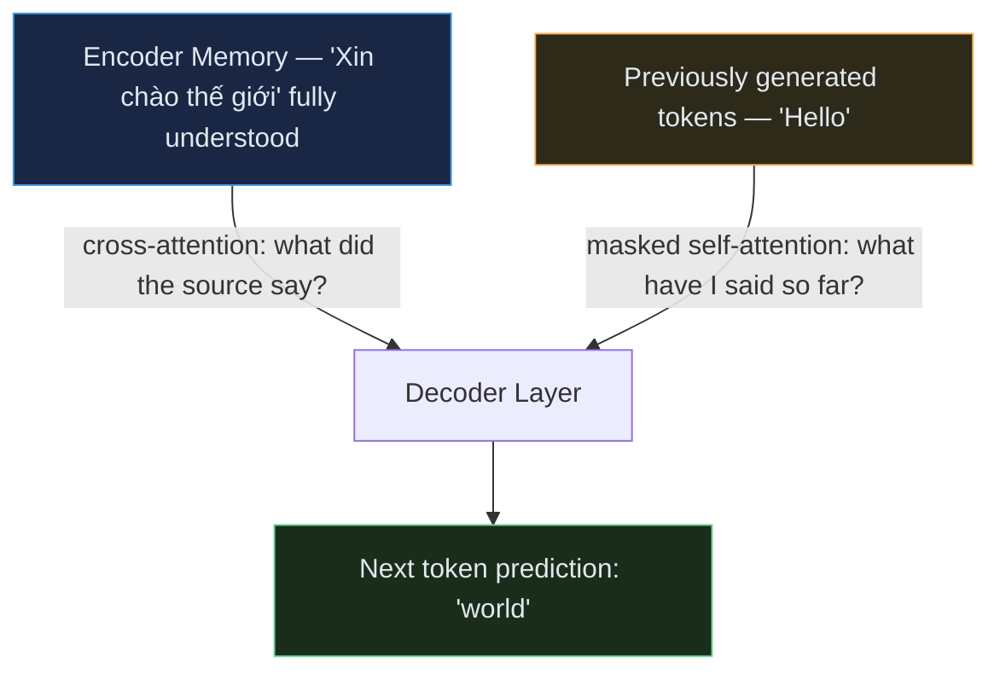
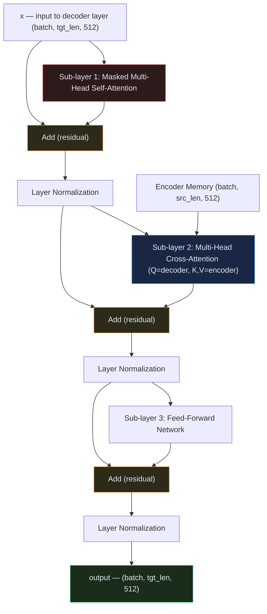
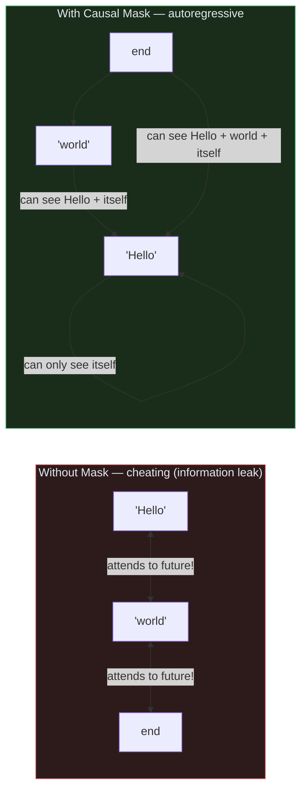
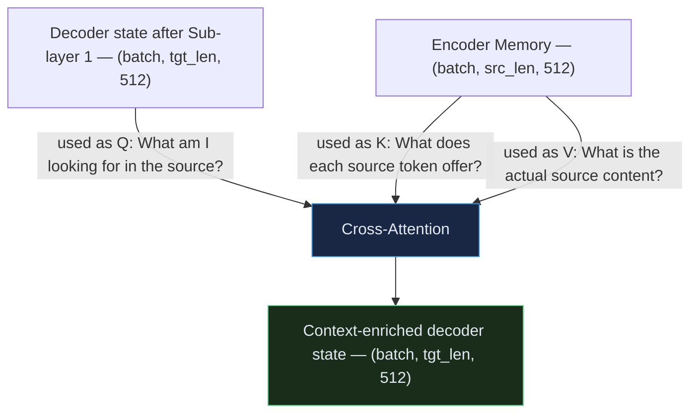
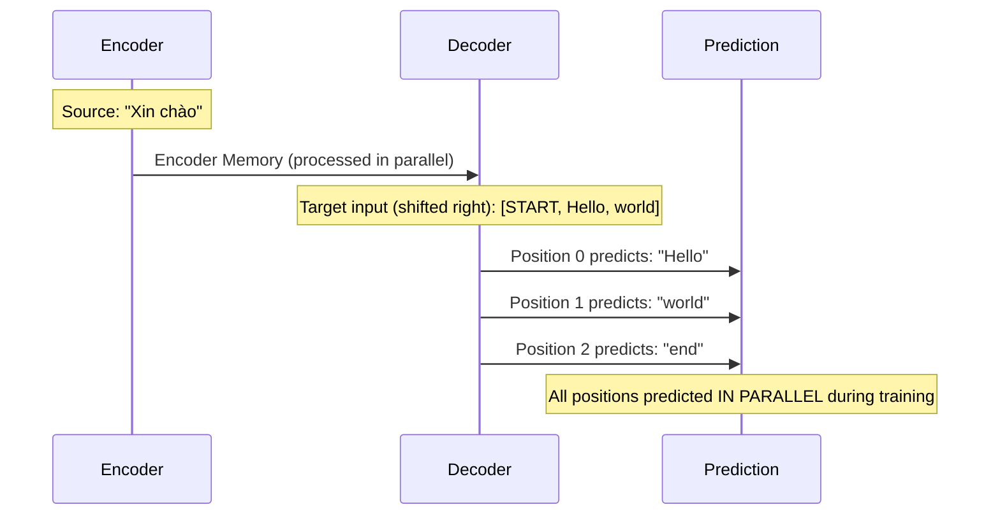
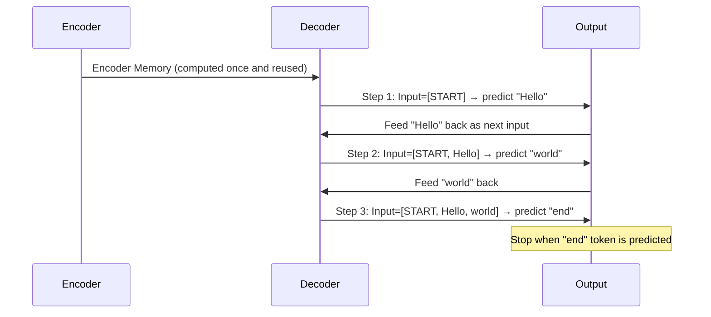

# Transformer — Module 06: Full Decoder Block

> **Paper Section:** 3.1 — Encoder and Decoder Stacks (Decoder part)
> **Previous:** [Module 05 — Full Encoder](05_encoder.md)
> **Next:** [Module 07 — Full Transformer + Working Example](07_full.md)

---

## 1. What is the Decoder?

The Decoder's job is to **generate** the output sequence, one token at a time, using:
1. What it has already generated (via **Masked Self-Attention**)
2. What the Encoder understood (via **Cross-Attention**)



---

## 2. The Decoder Has Three Sub-Layers (vs Encoder's Two)



| Sub-layer | Type | Q from | K, V from | Purpose |
| :--- | :--- | :--- | :--- | :--- |
| **1** | Masked Self-Attention | Decoder input | Decoder input (same) | Generated tokens understand each other |
| **2** | Cross-Attention | Decoder | Encoder Memory | Decoder reads the source |
| **3** | Feed-Forward | — | — | Nonlinear transformation per token |

---

## 3. Sub-Layer 1: Masked Multi-Head Self-Attention

### Why Masking?

The Decoder generates one token at a time — **left to right**. When predicting token at position `t`, the model must **not** see tokens at positions `t+1, t+2, ...` (they don't exist yet during inference).

Without masking, the decoder could "cheat" — simply copy the target token instead of learning to predict it.



### The Causal Mask

For a target sequence of length `tgt_len`, we use a **lower triangular** mask:

```
tgt_len = 4   (tokens: Hello, world, <end>, <pad>)

Mask:
         Hello  world  <end>  <pad>
Hello  [  1      0      0      0   ]   ← "Hello" can only attend to itself
world  [  1      1      0      0   ]   ← "world" can attend to "Hello" and itself
<end>  [  1      1      1      0   ]   ← "<end>" can attend to past 3
<pad>  [  1      1      1      1   ]   ← (ignored anyway)

1 = "allowed to attend"
0 = "set to -inf before softmax → zero attention weight"
```

---

## 4. Sub-Layer 2: Cross-Attention (Reading the Source)

This is where the Decoder "looks at" the Encoder's output.



**Key property:** The output sequence length (`tgt_len`) can be **different** from the input sequence length (`src_len`). Cross-attention handles this naturally because Q and K/V can have different sequence lengths.

```
Q shape:  (batch, tgt_len, d_model)   e.g., (2, 3, 512)  — decoder side
K shape:  (batch, src_len, d_model)   e.g., (2, 7, 512)  — encoder memory
V shape:  (batch, src_len, d_model)   e.g., (2, 7, 512)  — encoder memory

Attention weights: (batch, heads, tgt_len, src_len)  e.g., (2, 8, 3, 7)
Output:            (batch, tgt_len, d_model)          e.g., (2, 3, 512)
```

For each output token, cross-attention tells it: **"which source tokens are most relevant to generate me?"**

---

## 5. Training vs Inference

This is a critical distinction to understand.

### Training: Teacher Forcing

During training, we know the correct target ("Hello world `<end>`"). We feed the **entire correct target** (shifted right) at once, and predict all positions simultaneously. The causal mask enforces that position `t` only sees positions `< t`.



> **"Shifted right"**: The target input is `[<start>, Hello, world]` and the expected output is `[Hello, world, <end>]`. This is the standard teacher forcing setup.

### Inference: Autoregressive Generation

During inference, we **don't know** the target. We generate one token at a time:



This is called **autoregressive** generation — each prediction depends on all previous predictions.

---

## 6. Full Code: Decoder Layer + Decoder Stack

```python
import copy
import torch
import torch.nn as nn
import math
import torch.nn.functional as F

# (Re-importing all sub-modules from previous modules)

class ScaledDotProductAttention(nn.Module):
    def __init__(self, dropout=0.1):
        super().__init__()
        self.dropout = nn.Dropout(p=dropout)

    def forward(self, Q, K, V, mask=None):
        d_k = Q.size(-1)
        scores = torch.matmul(Q, K.transpose(-2, -1)) / math.sqrt(d_k)
        if mask is not None:
            scores = scores.masked_fill(mask == 0, float('-inf'))
        weights = F.softmax(scores, dim=-1)
        weights = self.dropout(weights)
        return torch.matmul(weights, V), weights


class MultiHeadAttention(nn.Module):
    def __init__(self, d_model=512, num_heads=8, dropout=0.1):
        super().__init__()
        assert d_model % num_heads == 0
        self.d_model = d_model
        self.num_heads = num_heads
        self.d_k = d_model // num_heads
        self.W_q = nn.Linear(d_model, d_model, bias=False)
        self.W_k = nn.Linear(d_model, d_model, bias=False)
        self.W_v = nn.Linear(d_model, d_model, bias=False)
        self.W_o = nn.Linear(d_model, d_model, bias=False)
        self.attention = ScaledDotProductAttention(dropout=dropout)

    def split_heads(self, x, b):
        return x.view(b, -1, self.num_heads, self.d_k).transpose(1, 2)

    def combine_heads(self, x, b):
        return x.transpose(1, 2).contiguous().view(b, -1, self.d_model)

    def forward(self, Q, K, V, mask=None):
        b = Q.size(0)
        Q = self.split_heads(self.W_q(Q), b)
        K = self.split_heads(self.W_k(K), b)
        V = self.split_heads(self.W_v(V), b)
        x, w = self.attention(Q, K, V, mask)
        return self.W_o(self.combine_heads(x, b)), w


class FeedForward(nn.Module):
    def __init__(self, d_model=512, d_ff=2048, dropout=0.1):
        super().__init__()
        self.linear1 = nn.Linear(d_model, d_ff)
        self.linear2 = nn.Linear(d_ff, d_model)
        self.dropout  = nn.Dropout(p=dropout)

    def forward(self, x):
        return self.linear2(self.dropout(F.relu(self.linear1(x))))


# ─────────────────────────────────────────────────────────────────────────────
# NEW: Decoder Layer
# ─────────────────────────────────────────────────────────────────────────────

class DecoderLayer(nn.Module):
    """
    One single Decoder layer containing:
        1. Masked Multi-Head Self-Attention  + Add & Norm
        2. Multi-Head Cross-Attention        + Add & Norm
        3. Feed-Forward Network              + Add & Norm
    """
    def __init__(self, d_model=512, num_heads=8, d_ff=2048, dropout=0.1):
        super().__init__()

        # Sub-layer 1: Masked Self-Attention (target attending to itself)
        self.masked_self_attention = MultiHeadAttention(d_model, num_heads, dropout)

        # Sub-layer 2: Cross-Attention (target attending to encoder memory)
        self.cross_attention = MultiHeadAttention(d_model, num_heads, dropout)

        # Sub-layer 3: Feed-Forward
        self.feed_forward = FeedForward(d_model, d_ff, dropout)

        # Three Add & Norm blocks (one per sub-layer)
        self.norm1 = nn.LayerNorm(d_model)
        self.norm2 = nn.LayerNorm(d_model)
        self.norm3 = nn.LayerNorm(d_model)
        self.dropout = nn.Dropout(p=dropout)

    def forward(
        self,
        x:            torch.Tensor,   # Decoder input  — (batch, tgt_len, d_model)
        encoder_memory: torch.Tensor, # Encoder output — (batch, src_len, d_model)
        tgt_mask:     torch.Tensor = None,  # Causal mask   — (1, 1, tgt_len, tgt_len)
        src_mask:     torch.Tensor = None,  # Padding mask  — (batch, 1, 1, src_len)
    ):
        # ── Sub-layer 1: Masked Self-Attention ────────────────────────────────
        # Q = K = V = x (decoder attends to itself)
        # tgt_mask prevents attending to future positions
        self_attn_out, _ = self.masked_self_attention(
            Q=x, K=x, V=x, mask=tgt_mask
        )
        x = self.norm1(x + self.dropout(self_attn_out))

        # ── Sub-layer 2: Cross-Attention ──────────────────────────────────────
        # Q = decoder state (what we're generating)
        # K = V = encoder_memory (what the source said)
        # src_mask prevents attending to padding in the source
        cross_attn_out, cross_weights = self.cross_attention(
            Q=x, K=encoder_memory, V=encoder_memory, mask=src_mask
        )
        x = self.norm2(x + self.dropout(cross_attn_out))

        # ── Sub-layer 3: Feed-Forward ─────────────────────────────────────────
        ffn_out = self.feed_forward(x)
        x = self.norm3(x + self.dropout(ffn_out))

        return x, cross_weights  # Return cross-attention weights for visualization


# ─────────────────────────────────────────────────────────────────────────────
# NEW: Full Decoder Stack
# ─────────────────────────────────────────────────────────────────────────────

class Decoder(nn.Module):
    """
    Full Transformer Decoder:
        Embedding + Positional Encoding → N × DecoderLayer → Linear + Softmax
    """
    def __init__(
        self,
        vocab_size:  int,
        d_model:     int   = 512,
        num_heads:   int   = 8,
        num_layers:  int   = 6,
        d_ff:        int   = 2048,
        max_seq_len: int   = 5000,
        dropout:     float = 0.1,
    ):
        super().__init__()
        self.token_embedding     = nn.Embedding(vocab_size, d_model)
        self.positional_encoding = self._build_pe(d_model, max_seq_len, dropout)
        self.d_model = d_model

        self.layers = nn.ModuleList([
            DecoderLayer(d_model, num_heads, d_ff, dropout)
            for _ in range(num_layers)
        ])

        # Final projection: d_model → vocab_size (used to compute logits)
        self.output_projection = nn.Linear(d_model, vocab_size)

    @staticmethod
    def _build_pe(d_model, max_len, dropout):
        """Build positional encoding layer (same as Module 01)."""
        class _PE(nn.Module):
            def __init__(self):
                super().__init__()
                self.dropout = nn.Dropout(p=dropout)
                pe = torch.zeros(max_len, d_model)
                pos = torch.arange(0, max_len).unsqueeze(1).float()
                div = torch.exp(torch.arange(0, d_model, 2).float() * (-math.log(10000.0) / d_model))
                pe[:, 0::2] = torch.sin(pos * div)
                pe[:, 1::2] = torch.cos(pos * div)
                self.register_buffer('pe', pe.unsqueeze(0))

            def forward(self, x):
                return self.dropout(x + self.pe[:, :x.size(1), :])
        return _PE()

    @staticmethod
    def make_causal_mask(tgt_len: int, device: torch.device) -> torch.Tensor:
        """
        Create lower-triangular causal mask.
        Returns shape: (1, 1, tgt_len, tgt_len)
        1 = allowed, 0 = blocked (will become -inf in attention)
        """
        mask = torch.tril(torch.ones(tgt_len, tgt_len, device=device))
        return mask.unsqueeze(0).unsqueeze(0)  # (1, 1, tgt_len, tgt_len)

    def forward(
        self,
        tgt:            torch.Tensor,   # Target token IDs — (batch, tgt_len)
        encoder_memory: torch.Tensor,   # Encoder output   — (batch, src_len, d_model)
        tgt_mask:       torch.Tensor = None,  # Causal mask
        src_mask:       torch.Tensor = None,  # Padding mask
    ):
        # Step 1: Embed target tokens
        x = self.token_embedding(tgt) * math.sqrt(self.d_model)
        x = self.positional_encoding(x)

        # Step 2: Auto-generate causal mask if not provided
        if tgt_mask is None:
            tgt_mask = self.make_causal_mask(tgt.size(1), tgt.device)

        # Step 3: Pass through N decoder layers
        all_cross_weights = []
        for layer in self.layers:
            x, cross_w = layer(x, encoder_memory, tgt_mask, src_mask)
            all_cross_weights.append(cross_w)

        # Step 4: Project to vocabulary logits
        logits = self.output_projection(x)  # (batch, tgt_len, vocab_size)

        return logits, all_cross_weights


# ── Demonstration ─────────────────────────────────────────────────────────────
if __name__ == "__main__":
    torch.manual_seed(42)

    VOCAB_SIZE = 30000
    D_MODEL    = 512
    NUM_HEADS  = 8
    NUM_LAYERS = 6
    D_FF       = 2048

    decoder = Decoder(
        vocab_size=VOCAB_SIZE, d_model=D_MODEL,
        num_heads=NUM_HEADS, num_layers=NUM_LAYERS, d_ff=D_FF
    )

    total_params = sum(p.numel() for p in decoder.parameters())
    print(f"Decoder total parameters: {total_params:,}")
    # Larger than encoder because decoder has 3 attention blocks per layer (vs 2)

    # Simulate encoder output (what Encoder produced)
    batch_size, src_len = 2, 7
    encoder_memory = torch.randn(batch_size, src_len, D_MODEL)

    # ── Training mode: teacher forcing ────────────────────────────────────────
    # Input: [<start>, Hello, world]  (shifted right target)
    # Expected output: [Hello, world, <end>]
    tgt_len = 3
    tgt_tokens = torch.randint(0, VOCAB_SIZE, (batch_size, tgt_len))

    decoder.eval()
    with torch.no_grad():
        logits, cross_weights = decoder(tgt_tokens, encoder_memory)

    print(f"\nTraining mode:")
    print(f"  Target input:    {tgt_tokens.shape}")        # (2, 3)
    print(f"  Encoder memory:  {encoder_memory.shape}")    # (2, 7, 512)
    print(f"  Logits output:   {logits.shape}")            # (2, 3, 30000)
    print(f"  Cross-weight:    {cross_weights[0].shape}")  # (2, 8, 3, 7)

    # Get predictions: argmax over vocab dimension
    predictions = logits.argmax(dim=-1)
    print(f"  Predicted token IDs: {predictions}")         # (2, 3)

    # ── Inference mode: autoregressive generation ──────────────────────────────
    print(f"\nInference mode (autoregressive):")
    START_ID = 1   # <start> token
    END_ID   = 2   # <end> token
    MAX_GEN  = 10  # max tokens to generate

    generated = torch.tensor([[START_ID]])  # (1, 1). batch_size=1 for inference
    enc_mem   = encoder_memory[:1]          # Use first example only

    for step in range(MAX_GEN):
        with torch.no_grad():
            out_logits, _ = decoder(generated, enc_mem)

        # Take the last position's logits and pick argmax
        next_token = out_logits[:, -1, :].argmax(dim=-1, keepdim=True)
        generated  = torch.cat([generated, next_token], dim=1)

        print(f"  Step {step+1}: generated token ID = {next_token.item()}")

        if next_token.item() == END_ID:
            print("  <end> token reached — generation complete!")
            break

    print(f"  Full generated sequence: {generated[0].tolist()}")
```

---

## 7. Visualizing Cross-Attention Weights

Cross-attention weights reveal what the decoder "looked at" in the source when generating each target token. This is one of the most interpretable parts of the Transformer:

```python
import matplotlib.pyplot as plt

def plot_cross_attention(cross_weights, src_tokens, tgt_tokens, layer=5, head=0):
    """
    Plot cross-attention weights for a specific layer and head.
    Rows = target tokens (what we're generating)
    Cols = source tokens (what we're reading from)
    """
    # cross_weights[layer]: (batch, heads, tgt_len, src_len)
    weights = cross_weights[layer][0, head].detach().numpy()

    fig, ax = plt.subplots(figsize=(8, 5))
    im = ax.imshow(weights, cmap='viridis', vmin=0, vmax=1)
    plt.colorbar(im, ax=ax)

    ax.set_xticks(range(len(src_tokens)))
    ax.set_yticks(range(len(tgt_tokens)))
    ax.set_xticklabels(src_tokens, rotation=45)
    ax.set_yticklabels(tgt_tokens)
    ax.set_xlabel("Source tokens (Encoder)")
    ax.set_ylabel("Target tokens (Decoder)")
    ax.set_title(f"Cross-Attention — Layer {layer+1}, Head {head+1}")
    plt.tight_layout()
    plt.savefig("cross_attention.png", dpi=150)
    plt.show()

# Usage
src_tokens = ["Xin", "chào", "thế", "giới"]
tgt_tokens = ["Hello", "world"]
plot_cross_attention(cross_weights, src_tokens, tgt_tokens)

# Expected pattern:
# "Hello" should attend strongly to "Xin chào" (greeting part)
# "world" should attend strongly to "thế giới" (world part)
```

---

## 8. Key Takeaways

| Concept | Key Point |
| :--- | :--- |
| **Three sub-layers** | Masked Self-Attn + Cross-Attn + FFN (vs Encoder's two) |
| **Causal mask** | Lower triangular — prevents attending to future positions |
| **Cross-attention** | Q from decoder, K/V from encoder — decoder reads the source |
| **Cross-attention output shape** | `(batch, tgt_len, d_model)` — tgt_len can differ from src_len |
| **Teacher forcing** | Training: entire target sequence fed at once, all positions predicted in parallel |
| **Autoregressive** | Inference: one token at a time, each fed back as input |
| **Cross-attention weights** | Interpretable — shows which source tokens the decoder looked at |

> [!IMPORTANT]
> The Decoder is **much more expensive** than the Encoder at inference time because of autoregressive generation. Each new token requires a full forward pass through all 6 decoder layers. This is why decoder-only models (GPT) have high inference latency compared to encoder-only models (BERT).

---

## 9. What's Next

We have all the pieces. In the final module, we assemble the complete Transformer, run a working translation example, and connect everything back to modern models.

| Next | Topic |
| :--- | :--- |
| `07_full.md` | Full Transformer assembled + working mini translation demo |
