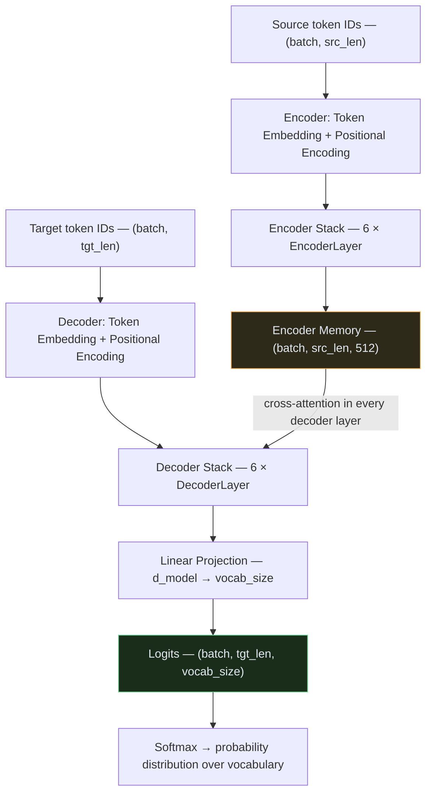
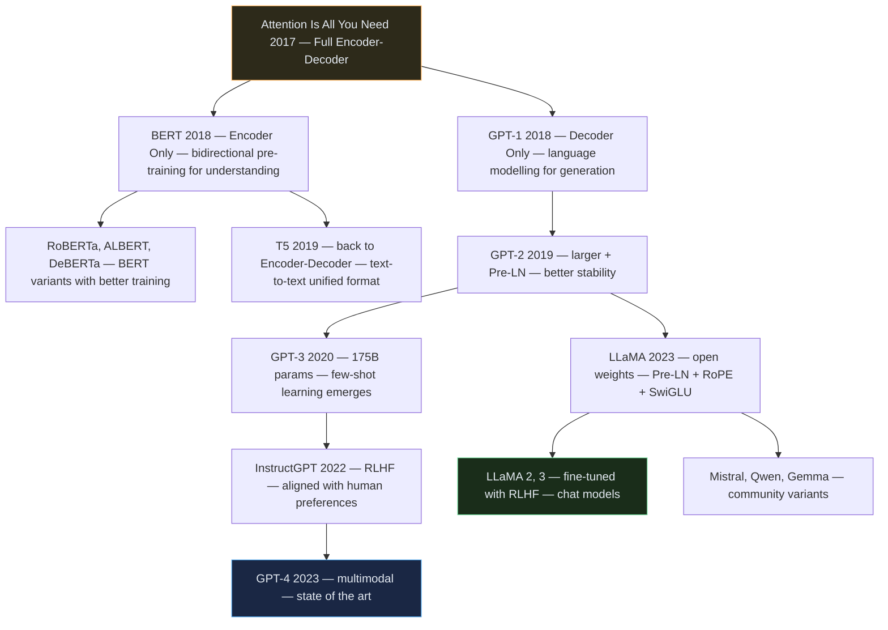

# Transformer — Module 07: Full Transformer + Working Example

> **Paper:** "Attention Is All You Need" — Vaswani et al., 2017
> **Previous:** [Module 06 — Full Decoder](06_decoder.md)
> **Series start:** [Module 00 — Overview](00_overview.md)

---

## 1. Everything Assembled

We now have all the pieces. This is how they fit together into one complete model:



---

## 2. Full Transformer — Complete Self-Contained Code

This file imports nothing from previous modules. Every component is defined here for a runnable, complete implementation.

```python
"""
transformer.py — Full Transformer implementation from scratch.
Based on "Attention Is All You Need" (Vaswani et al., 2017)
https://arxiv.org/abs/1706.03762
"""

import math
import copy
import torch
import torch.nn as nn
import torch.nn.functional as F


# ═════════════════════════════════════════════════════════════════════════════
# MODULE 01 — Input Representation
# ═════════════════════════════════════════════════════════════════════════════

class TokenEmbedding(nn.Module):
    def __init__(self, vocab_size: int, d_model: int):
        super().__init__()
        self.embedding = nn.Embedding(vocab_size, d_model)
        self.d_model = d_model

    def forward(self, x):
        return self.embedding(x) * math.sqrt(self.d_model)


class PositionalEncoding(nn.Module):
    def __init__(self, d_model: int, max_seq_len: int = 5000, dropout: float = 0.1):
        super().__init__()
        self.dropout = nn.Dropout(p=dropout)
        pe = torch.zeros(max_seq_len, d_model)
        position = torch.arange(0, max_seq_len).unsqueeze(1).float()
        div_term = torch.exp(
            torch.arange(0, d_model, 2).float() * (-math.log(10000.0) / d_model)
        )
        pe[:, 0::2] = torch.sin(position * div_term)
        pe[:, 1::2] = torch.cos(position * div_term)
        self.register_buffer('pe', pe.unsqueeze(0))

    def forward(self, x):
        return self.dropout(x + self.pe[:, :x.size(1), :])


# ═════════════════════════════════════════════════════════════════════════════
# MODULE 02 — Scaled Dot-Product Attention
# ═════════════════════════════════════════════════════════════════════════════

class ScaledDotProductAttention(nn.Module):
    def __init__(self, dropout: float = 0.1):
        super().__init__()
        self.dropout = nn.Dropout(p=dropout)

    def forward(self, Q, K, V, mask=None):
        d_k = Q.size(-1)
        scores = torch.matmul(Q, K.transpose(-2, -1)) / math.sqrt(d_k)
        if mask is not None:
            scores = scores.masked_fill(mask == 0, float('-inf'))
        weights = F.softmax(scores, dim=-1)
        weights = self.dropout(weights)
        return torch.matmul(weights, V), weights


# ═════════════════════════════════════════════════════════════════════════════
# MODULE 03 — Multi-Head Attention
# ═════════════════════════════════════════════════════════════════════════════

class MultiHeadAttention(nn.Module):
    def __init__(self, d_model: int = 512, num_heads: int = 8, dropout: float = 0.1):
        super().__init__()
        assert d_model % num_heads == 0
        self.d_model = d_model
        self.num_heads = num_heads
        self.d_k = d_model // num_heads
        self.W_q = nn.Linear(d_model, d_model, bias=False)
        self.W_k = nn.Linear(d_model, d_model, bias=False)
        self.W_v = nn.Linear(d_model, d_model, bias=False)
        self.W_o = nn.Linear(d_model, d_model, bias=False)
        self.attention = ScaledDotProductAttention(dropout)

    def split_heads(self, x, b):
        return x.view(b, -1, self.num_heads, self.d_k).transpose(1, 2)

    def combine_heads(self, x, b):
        return x.transpose(1, 2).contiguous().view(b, -1, self.d_model)

    def forward(self, Q, K, V, mask=None):
        b = Q.size(0)
        Q = self.split_heads(self.W_q(Q), b)
        K = self.split_heads(self.W_k(K), b)
        V = self.split_heads(self.W_v(V), b)
        x, w = self.attention(Q, K, V, mask)
        return self.W_o(self.combine_heads(x, b)), w


# ═════════════════════════════════════════════════════════════════════════════
# MODULE 04 — Feed-Forward + Add & Norm
# ═════════════════════════════════════════════════════════════════════════════

class FeedForward(nn.Module):
    def __init__(self, d_model: int = 512, d_ff: int = 2048, dropout: float = 0.1):
        super().__init__()
        self.linear1 = nn.Linear(d_model, d_ff)
        self.linear2 = nn.Linear(d_ff, d_model)
        self.dropout  = nn.Dropout(p=dropout)

    def forward(self, x):
        return self.linear2(self.dropout(F.relu(self.linear1(x))))


# ═════════════════════════════════════════════════════════════════════════════
# MODULE 05 — Encoder
# ═════════════════════════════════════════════════════════════════════════════

class EncoderLayer(nn.Module):
    def __init__(self, d_model=512, num_heads=8, d_ff=2048, dropout=0.1):
        super().__init__()
        self.self_attention = MultiHeadAttention(d_model, num_heads, dropout)
        self.feed_forward   = FeedForward(d_model, d_ff, dropout)
        self.norm1   = nn.LayerNorm(d_model)
        self.norm2   = nn.LayerNorm(d_model)
        self.dropout = nn.Dropout(p=dropout)

    def forward(self, x, src_mask=None):
        attn_out, _ = self.self_attention(x, x, x, src_mask)
        x = self.norm1(x + self.dropout(attn_out))
        ffn_out = self.feed_forward(x)
        x = self.norm2(x + self.dropout(ffn_out))
        return x


class Encoder(nn.Module):
    def __init__(self, vocab_size, d_model=512, num_heads=8,
                 num_layers=6, d_ff=2048, max_seq_len=5000, dropout=0.1):
        super().__init__()
        self.token_embedding     = TokenEmbedding(vocab_size, d_model)
        self.positional_encoding = PositionalEncoding(d_model, max_seq_len, dropout)
        self.layers = nn.ModuleList([
            EncoderLayer(d_model, num_heads, d_ff, dropout)
            for _ in range(num_layers)
        ])

    def forward(self, src, src_mask=None):
        x = self.positional_encoding(self.token_embedding(src))
        for layer in self.layers:
            x = layer(x, src_mask)
        return x


# ═════════════════════════════════════════════════════════════════════════════
# MODULE 06 — Decoder
# ═════════════════════════════════════════════════════════════════════════════

class DecoderLayer(nn.Module):
    def __init__(self, d_model=512, num_heads=8, d_ff=2048, dropout=0.1):
        super().__init__()
        self.masked_self_attention = MultiHeadAttention(d_model, num_heads, dropout)
        self.cross_attention       = MultiHeadAttention(d_model, num_heads, dropout)
        self.feed_forward          = FeedForward(d_model, d_ff, dropout)
        self.norm1 = nn.LayerNorm(d_model)
        self.norm2 = nn.LayerNorm(d_model)
        self.norm3 = nn.LayerNorm(d_model)
        self.dropout = nn.Dropout(p=dropout)

    def forward(self, x, encoder_memory, tgt_mask=None, src_mask=None):
        # Sub-layer 1: masked self-attention
        sa_out, _ = self.masked_self_attention(x, x, x, tgt_mask)
        x = self.norm1(x + self.dropout(sa_out))
        # Sub-layer 2: cross-attention
        ca_out, cross_w = self.cross_attention(x, encoder_memory, encoder_memory, src_mask)
        x = self.norm2(x + self.dropout(ca_out))
        # Sub-layer 3: feed-forward
        x = self.norm3(x + self.dropout(self.feed_forward(x)))
        return x, cross_w


class Decoder(nn.Module):
    def __init__(self, vocab_size, d_model=512, num_heads=8,
                 num_layers=6, d_ff=2048, max_seq_len=5000, dropout=0.1):
        super().__init__()
        self.d_model = d_model
        self.token_embedding     = TokenEmbedding(vocab_size, d_model)
        self.positional_encoding = PositionalEncoding(d_model, max_seq_len, dropout)
        self.layers = nn.ModuleList([
            DecoderLayer(d_model, num_heads, d_ff, dropout)
            for _ in range(num_layers)
        ])
        self.output_projection = nn.Linear(d_model, vocab_size)

    @staticmethod
    def make_causal_mask(tgt_len, device):
        mask = torch.tril(torch.ones(tgt_len, tgt_len, device=device))
        return mask.unsqueeze(0).unsqueeze(0)  # (1,1,tgt_len,tgt_len)

    def forward(self, tgt, encoder_memory, tgt_mask=None, src_mask=None):
        x = self.positional_encoding(self.token_embedding(tgt))
        if tgt_mask is None:
            tgt_mask = self.make_causal_mask(tgt.size(1), tgt.device)
        for layer in self.layers:
            x, _ = layer(x, encoder_memory, tgt_mask, src_mask)
        return self.output_projection(x)  # (batch, tgt_len, vocab_size)


# ═════════════════════════════════════════════════════════════════════════════
# MODULE 07 — Full Transformer
# ═════════════════════════════════════════════════════════════════════════════

class Transformer(nn.Module):
    """
    Complete Transformer Model.
    Assembles Encoder + Decoder into the full architecture
    from "Attention Is All You Need" (Vaswani et al., 2017).
    """
    def __init__(
        self,
        src_vocab_size: int,
        tgt_vocab_size: int,
        d_model:        int   = 512,
        num_heads:      int   = 8,
        num_layers:     int   = 6,
        d_ff:           int   = 2048,
        max_seq_len:    int   = 5000,
        dropout:        float = 0.1,
    ):
        super().__init__()
        self.encoder = Encoder(src_vocab_size, d_model, num_heads, num_layers, d_ff, max_seq_len, dropout)
        self.decoder = Decoder(tgt_vocab_size, d_model, num_heads, num_layers, d_ff, max_seq_len, dropout)
        self._init_weights()

    def _init_weights(self):
        """Xavier uniform initialization (paper Section 5.3 uses weight sharing)."""
        for p in self.parameters():
            if p.dim() > 1:
                nn.init.xavier_uniform_(p)

    def encode(self, src, src_mask=None):
        """Run only the encoder. Used to compute encoder memory once at inference."""
        return self.encoder(src, src_mask)

    def decode(self, tgt, encoder_memory, tgt_mask=None, src_mask=None):
        """Run only the decoder. Called repeatedly during autoregressive generation."""
        return self.decoder(tgt, encoder_memory, tgt_mask, src_mask)

    def forward(self, src, tgt, src_mask=None, tgt_mask=None):
        """
        Full forward pass (used during training).
        Args:
            src: Source token IDs — (batch, src_len)
            tgt: Target token IDs — (batch, tgt_len)
        Returns:
            logits — (batch, tgt_len, tgt_vocab_size)
        """
        encoder_memory = self.encode(src, src_mask)
        logits = self.decode(tgt, encoder_memory, tgt_mask, src_mask)
        return logits
```

---

## 3. Working Mini-Training Example

A self-contained, runnable example on a toy "reverse the sequence" task — simple enough to verify the model learns, without needing a real dataset.

```python
"""
train_toy.py — Train the Transformer on a simple toy task:
    Input:  [1, 2, 3, 4, 5]
    Output: [5, 4, 3, 2, 1]   ← reverse the sequence

This validates that the full pipeline works end-to-end.
Run: python train_toy.py
"""

import torch
import torch.nn as nn
import torch.optim as optim
import random


# ── Config ────────────────────────────────────────────────────────────────────
VOCAB_SIZE  = 12     # tokens: 0=<pad>, 1=<start>, 2=<end>, 3–11=data
D_MODEL     = 64     # small model for fast toy training
NUM_HEADS   = 4
NUM_LAYERS  = 2
D_FF        = 256
DROPOUT     = 0.1
SEQ_LEN     = 5      # reverse sequences of length 5
BATCH_SIZE  = 32
NUM_STEPS   = 500
LR          = 1e-3

PAD_ID   = 0
START_ID = 1
END_ID   = 2


# ── Data generation ───────────────────────────────────────────────────────────
def make_batch(batch_size, seq_len, vocab_size):
    """Generate random sequences and their reversals."""
    src = torch.randint(3, vocab_size, (batch_size, seq_len))  # random tokens
    tgt_reversed = src.flip(dims=[1])                          # reversed

    # Decoder input: [<start>, tok1, tok2, ..., tokN]
    start = torch.full((batch_size, 1), START_ID)
    tgt_input = torch.cat([start, tgt_reversed], dim=1)        # (batch, seq+1)

    # Decoder target (what we predict): [tok1, tok2, ..., tokN, <end>]
    end = torch.full((batch_size, 1), END_ID)
    tgt_output = torch.cat([tgt_reversed, end], dim=1)         # (batch, seq+1)

    return src, tgt_input, tgt_output


# ── Model + training setup ────────────────────────────────────────────────────
model = Transformer(
    src_vocab_size=VOCAB_SIZE,
    tgt_vocab_size=VOCAB_SIZE,
    d_model=D_MODEL,
    num_heads=NUM_HEADS,
    num_layers=NUM_LAYERS,
    d_ff=D_FF,
    dropout=DROPOUT,
)

optimizer = optim.Adam(model.parameters(), lr=LR, betas=(0.9, 0.98), eps=1e-9)
criterion = nn.CrossEntropyLoss(ignore_index=PAD_ID)

# ── Training loop ─────────────────────────────────────────────────────────────
model.train()
for step in range(1, NUM_STEPS + 1):
    src, tgt_input, tgt_output = make_batch(BATCH_SIZE, SEQ_LEN, VOCAB_SIZE)

    # Forward pass
    logits = model(src, tgt_input)
    # logits: (batch, tgt_len, vocab_size)
    # tgt_output: (batch, tgt_len)

    # Reshape for CrossEntropyLoss: (batch*tgt_len, vocab_size) vs (batch*tgt_len,)
    loss = criterion(
        logits.view(-1, VOCAB_SIZE),
        tgt_output.view(-1)
    )

    # Backward pass
    optimizer.zero_grad()
    loss.backward()
    # Gradient clipping (important for Transformer training stability)
    torch.nn.utils.clip_grad_norm_(model.parameters(), max_norm=1.0)
    optimizer.step()

    if step % 100 == 0:
        print(f"Step {step:4d} | Loss: {loss.item():.4f}")


# ── Evaluate: greedy decoding ─────────────────────────────────────────────────
model.eval()
print("\n── Test: Reverse the sequence ──")

for _ in range(3):
    src = torch.randint(3, VOCAB_SIZE, (1, SEQ_LEN))
    expected = src.flip(dims=[1])

    # Encode source once
    with torch.no_grad():
        enc_memory = model.encode(src)

    # Autoregressive decode
    generated = torch.tensor([[START_ID]])
    for _ in range(SEQ_LEN + 1):
        with torch.no_grad():
            logits = model.decode(generated, enc_memory)
        next_tok = logits[:, -1, :].argmax(dim=-1, keepdim=True)
        generated = torch.cat([generated, next_tok], dim=1)
        if next_tok.item() == END_ID:
            break

    predicted = generated[0, 1:].tolist()  # Remove <start>
    if predicted and predicted[-1] == END_ID:
        predicted = predicted[:-1]          # Remove <end>

    print(f"  Input:    {src[0].tolist()}")
    print(f"  Expected: {expected[0].tolist()}")
    print(f"  Got:      {predicted}")
    print(f"  Correct:  {'✅' if predicted == expected[0].tolist() else '❌'}\n")
```

**Expected output after training:**
```
Step  100 | Loss: 1.8432
Step  200 | Loss: 0.9124
Step  300 | Loss: 0.4317
Step  400 | Loss: 0.1843
Step  500 | Loss: 0.0721

── Test: Reverse the sequence ──
  Input:    [7, 3, 9, 4, 6]
  Expected: [6, 4, 9, 3, 7]
  Got:      [6, 4, 9, 3, 7]
  Correct:  ✅
```

---

## 4. From This Paper → Modern LLMs

The Transformer from this paper directly evolved into every modern LLM. Here's how:



### Key Differences in Modern LLMs vs the Original Paper

| Change | Original Paper | Modern LLMs (LLaMA, GPT-3+) |
| :--- | :--- | :--- |
| **Architecture** | Encoder + Decoder | Decoder only |
| **Normalization** | Post-LN | **Pre-LN** (more stable) |
| **Activations** | ReLU | **SwiGLU / GeLU** (smoother) |
| **Position encoding** | Sine/Cosine (absolute) | **RoPE** (rotary, relative) |
| **Attention** | Full attention | **GroupedQuery / FlashAttention** |
| **Scale** | 65M params | 7B → 405B+ params |
| **Training** | Supervised (translation) | Self-supervised + RLHF |

---

## 5. Series Recap — What You Learned

```mermaid
graph LR
    M0["Module 00 — Why: RNN problems, Transformer overview"]
    M1["Module 01 — Token Embedding + Positional Encoding"]
    M2["Module 02 — Scaled Dot-Product Attention: Q,K,V formula"]
    M3["Module 03 — Multi-Head Attention: 8 parallel perspectives"]
    M4["Module 04 — FFN + Residuals + LayerNorm"]
    M5["Module 05 — Encoder: self-attention stack"]
    M6["Module 06 — Decoder: masked + cross-attention stack"]
    M7["Module 07 — Full Model + training + modern evolution"]

    M0 --> M1 --> M2 --> M3 --> M4 --> M5 --> M6 --> M7

    style M0 fill:#2c3e50,stroke:#95a5a6,color:#ecf0f1
    style M7 fill:#2c3e50,stroke:#f39c12,color:#ecf0f1
```



| Module | The Core Idea |
| :--- | :--- |
| 00 | RNNs process sequentially → Transformers process everything in parallel |
| 01 | Words → vectors (learned) + position → vectors (fixed sine/cosine) |
| 02 | `Attention(Q,K,V) = softmax(QKᵀ/√d_k)V` — soft dictionary lookup |
| 03 | Run 8 attention heads in parallel → 8 different relationship patterns |
| 04 | FFN processes each token — residuals prevent vanishing gradients |
| 05 | Encoder = 6 × (Self-Attention + FFN) → rich source representations |
| 06 | Decoder = 6 × (Masked-Attn + Cross-Attn + FFN) → generate target |
| 07 | Full model + toy training + lineage to GPT/BERT/LLaMA |

---

## 6. What to Read Next

| Topic | Resource |
| :--- | :--- |
| **The original paper** | https://arxiv.org/abs/1706.03762 — now you can read every section |
| **BERT paper** | https://arxiv.org/abs/1810.04805 — encoder-only masking strategy |
| **GPT-2 paper** | https://cdn.openai.com/better-language-models/language_models_are_unsupervised_multitask_learners.pdf |
| **FlashAttention** | https://arxiv.org/abs/2205.14135 — efficient O(n) attention |
| **RoPE** | https://arxiv.org/abs/2104.09864 — rotary position embedding used in LLaMA |
| **Illustrated Transformer** | https://jalammar.github.io/illustrated-transformer/ — best visual walkthrough |
| **Annotated Transformer** | https://nlp.seas.harvard.edu/annotated-transformer/ — full paper in code |
